深入浅出计算机组成原理
----

https://time.geekbang.org/column/intro/170

发布时间：2019

在计算机专业十余门核心课程中，计算机组成原理是当之无愧的第一课。

无论想要**向上**学习计算机的底层知识，比如编译原理、操作系统、体系结构，还是想要**向下**学习数字电路、数字逻辑等内容，都要先掌握计算机组成原理。

学习计算机组成原理，就是通过指令、计算、CPU、存储系统和 I/O，掌握整个计算机运作过程的核心知识点；通过拆解程序的执行过程，对计算机系统有一个全貌的了解。


# 入门篇

学什么、怎么学、有什么用。

## 0 为什么你需要学习计算机组成原理？

徐文浩，一个正在创业的工程师。目前主要是通过自然语言处理技术，为走向海外的中国企业提供英语的智能客服和社交网络营销服务。

2005 年从上海交通大学计算机系毕业之后，我一直以写代码为生。如果从 7 岁第一次在少年宫写程序开始算起，到今天，我的码龄快有 30 岁了。这些年里，我在 Trilogy Software 写过各种大型企业软件；在 MediaV 这样的广告科技公司，从零开始搭建过支撑每天百亿流量的广告算法系统；2015 年，我又加入了拼多多，参与重写拼多多的交易系统。

这么多年一直在开发软件，我深感软件这个行业变化太快了。语言上，十年前流行 Java，这两年流行 Go；框架上，前两年流行 TensorFlow，最近又流行 PyTorch。我逐渐发现，学习应用层的各种语言、框架，好比在练拳法招式，可以短期给予你回报，而**深入学习“底层知识”，就是在练扎马步、核心肌肉力量，是在提升你自己的“根骨”和“资质”**。

> 如果越早去弄清楚计算机的底层原理，在你的知识体系中“储蓄”起这些知识，也就意味着你有越长的时间来收获学习知识的“利息”。虽然一开始可能不起眼，但是随着时间带来的复利效应，你的长线投资项目，就能让你在成长的过程中越走越快。

### 计算机底层知识的“第一课”

计算机是由 CPU、内存、显示器这些设备组成的硬件，但是，计算机系的学生毕业之后，大部分却都是从事各种软件开发工作。显然，在硬件和软件之间需要一座桥梁，而“计算机组成原理”就扮演了这样一个角色，它既==隔离==了软件和硬件，也提供了让软件无需关心硬件，就能直接操作硬件的==接口==。

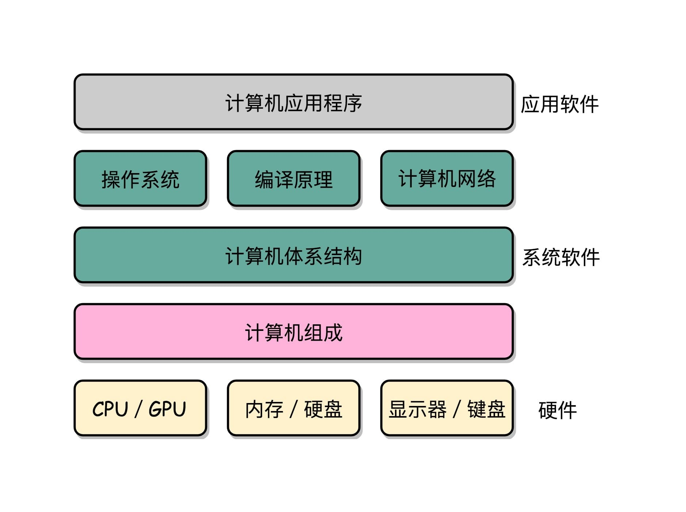

### 理论和实践相结合


相关书籍读不下去的原因：

1. **广**。组成原理中的概念非常多，每个概念的信息量也非常大。比如想要理解 CPU 中的算术逻辑单元（也就是 ALU）是怎么实现加法的，需要牵涉到如何把整数表示成二进制，还需要了解这些表示背后的电路、逻辑门、CPU 时钟、触发器等知识。
2. **深**。组成原理中的很多概念，阐述开来就是计算机学科的另外一门核心课程。比如，计算机的指令是怎么从你写的 C、Java 这样的高级语言，变成计算机可以执行的机器码的？如果我们展开并深入讲解这个问题，就会变成《编译原理》这样一门核心课程。
3. **学不能致用**。学东西是要拿来用的，但因为这门课本身的属性，很多人在学习时，常常沉溺于概念和理论中，无法和自己日常的开发工作联系起来，以此来解决工作中遇到的问题，所以，学习往往没有成就感，就很难有动力坚持下去。

## 1  冯·诺依曼体系结构：计算机组成的金字塔

### 计算机的基本硬件组成

CPU、内存和主板

主板是一个有着各种各样，有时候多达数十乃至上百个插槽的配件。

CPU 要插在主板上，内存也要插在主板上。主板的==芯片组（Chipset）==和==总线（Bus）==解决了 CPU 和内存之间如何通信的问题。芯片组控制了数据传输的流转，也就是数据从哪里到哪里的问题。总线则是实际数据传输的高速公路。因此，==总线速度（Bus Speed）==决定了数据能传输得多快。


显卡（Graphics Card） GPU（Graphics Processing Unit，图形处理器）

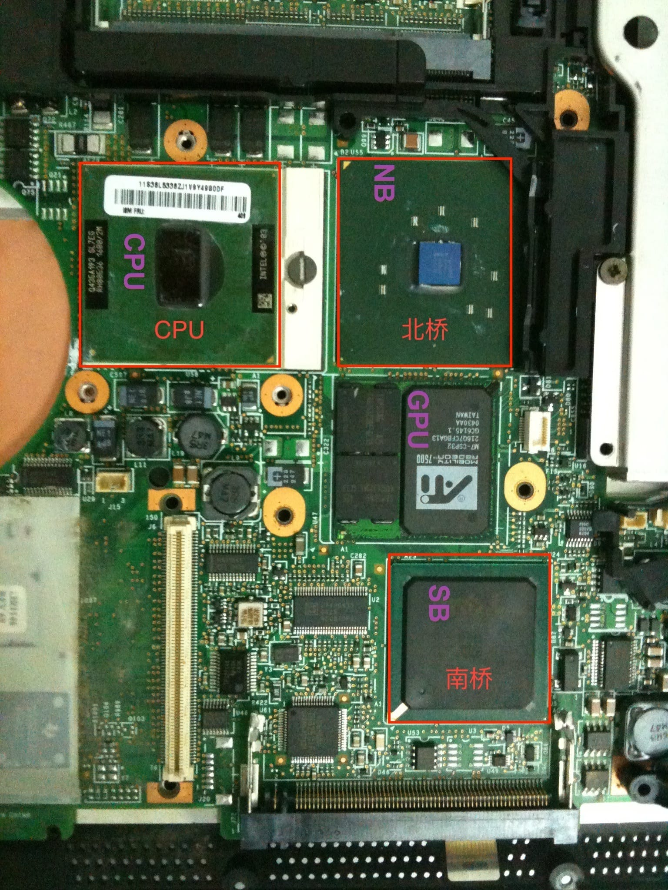

南桥（SouthBridge）芯片组控制鼠标、键盘以及硬盘这些外部设备和 CPU 之间的通信。

“北桥”芯片，以前用来作为“桥”，连接 CPU 和内存、显卡之间的通信。不过，随着时间的变迁，现在的主板上的“北桥”芯片的工作，已经被移到了 CPU 的内部了。

### 冯·诺依曼体系结构

因为手机尺寸的原因，手机制造商们选择把 CPU、内存、网络通信，乃至摄像头芯片，都封装到一个芯片，然后再嵌入到手机主板上。这种方式叫 ==SoC==，也就是 System on a Chip（系统芯片）。

无论是个人电脑、服务器、智能手机，还是 Raspberry Pi 这样的微型卡片机，都遵循着同一个“计算机”的抽象概念，就是==冯·诺依曼体系结构==（Von Neumann architecture），也叫==存储程序计算机==。

存储程序计算机暗含了两个概念：一个是“==可编程==”计算机，一个是“==存储==”计算机。

“不可编程”：计算机是由各种门电路组合而成的，然后通过组装出一个固定的电路板，来完成一个特定的计算程序。一旦需要修改功能，就要重新组装电路。（程序在计算机硬件层面是“写死”的）

最常见的就是老式计算器，电路板设好了加减乘除，做不了任何计算逻辑固定之外的事情。

“存储”表示程序本身是存储在计算机的内存里，可以通过加载不同的程序来解决不同的问题。

> 早年的“Plugboard”这样的插线板式的计算机就是不能存储的。

冯祖师爷，[First Draft of a Report on the EDVAC](https://en.wikipedia.org/wiki/First_Draft_of_a_Report_on_the_EDVAC)（**First Draft**，《第一份草案》），描述了计算机组成。

> 任何一台计算机的任何一个部件都可以归到运算器、控制器、存储器、输入设备和输出设备中，而所有的现代计算机也都是基于这个基础架构来设计开发的。

而所有的计算机程序，也都可以抽象为从**输入设备**读取输入信息，通过**运算器**和**控制器**来执行存储在**存储器**里的程序，最终把结果输出到**输出设备**中。而我们所有撰写的无论高级还是低级语言的程序，也都是基于这样一个抽象框架来进行运作的。

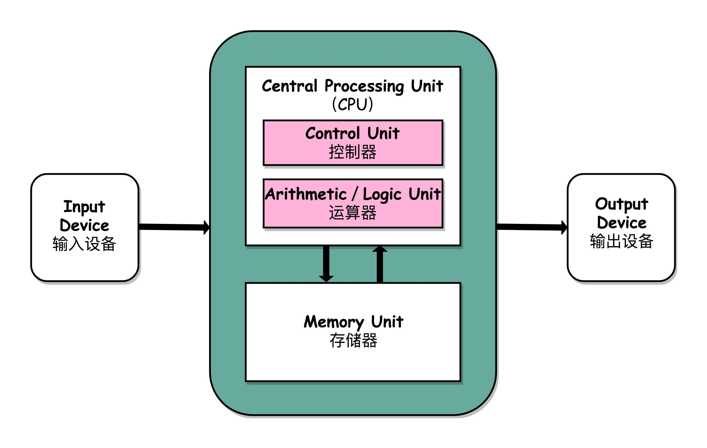

## 2 计算机组成原理知识地图

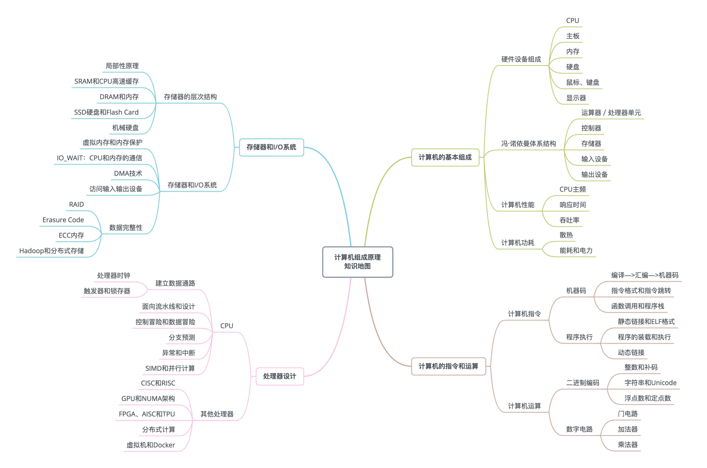


五大基本**组件运算器、控制器、存储器、输入设备和输出设备**。

计算机的两个核心指标，==性能和功耗==。


浮点数（Floating Point）

==CPU时钟==可以用来构造寄存器和内存的锁存器和触发器。

### 入门书籍

《计算机是怎样跑起来的》

《程序是怎样跑起来的》入门微缩版本的“计算机组成原理”。

北京大学免费公开课[《Computer Organization》](https://www.coursera.org/learn/jisuanji-zucheng)：硬件层面的基础实现，比如寄存器、ALU 这些电路是怎么回事

### 深入学习书籍

《计算机组成与设计：硬件 / 软件接口》

《深入理解计算机系统》  https://www.bilibili.com/video/av24540152/

自操作系统大神塔能鲍姆（Andrew S. Tanenbaum）的《计算机组成：结构化方法》，适合作为一个辅助的参考书

《计算机体系结构：量化研究方法》

### 课外阅读

对于资深程序员来说，来自 Redhat 的 What Every Programmer Should Know About Memory 是写出高性能程序不可不读的经典材料

《编码：隐匿在计算机软硬件背后的语言》和《程序员的自我修养：链接、装载和库》是理解计算机硬件和操作系统层面代码执行的优秀阅读材料。

## 3 CPU主频——“性能”究竟是什么？

### 什么是性能？时间的倒数

计算机的性能衡量的两个指标：

- **响应时间**（Response time）或者叫执行时间（Execution time）【“跑得更快”】

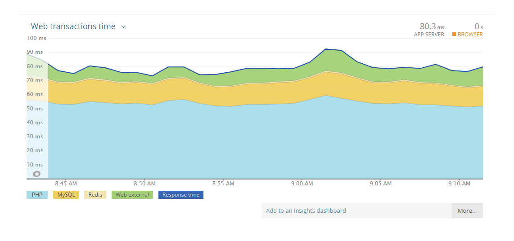

- 吞吐率（Throughput）或者带宽（Bandwidth）【“搬得更多”】

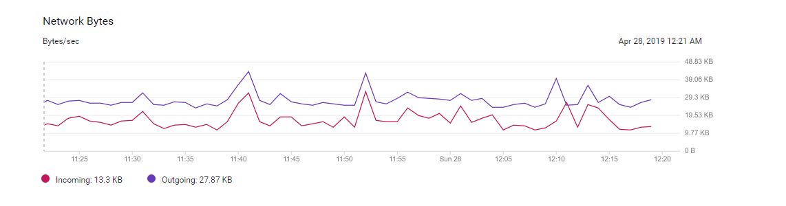

响应时间指的就是，我们执行一个程序，到底需要花多少时间。花的时间越少，自然性能就越好。

吞吐率是指在一定的时间范围内，到底能处理多少事情。这里的“事情”，在计算机里就是处理的数据或者执行的程序指令。

缩短程序的响应时间，一般来说都会提升吞吐率。

除了缩短响应时间，还可以多找几个人一起来搬，这就类似现代的服务器都是 8 核、16 核的。人多力量大，同时处理数据，在单位时间内就可以处理更多数据，吞吐率自然也就上去了。

响应时间的提升没那么容易，不能像吞吐率那样添加硬件。

一般把性能，定义成响应时间的倒数，也就是：

`性能 = 1/响应时间`

过去几年流行的手机跑分软件，就是把多个预设好的程序在手机上运行，然后根据运行需要的时间，算出一个分数来给出手机的性能评估。而在业界，各大 CPU 和服务器厂商组织了一个叫作 **SPEC**（Standard Performance Evaluation Corporation）的第三方机构，专门用来指定各种“跑分”的规则。

SPEC 提供的 CPU 基准测试程序，就好像 CPU 届的“高考”，通过数十个不同的计算程序，对于 CPU 的性能给出一个最终评分。这些程序丰富多彩，有编译器、解释器、视频压缩、人工智能国际象棋等等，涵盖了方方面面的应用场景。https://www.spec.org/cpu2017/results/cpu2017.html

### 计算机的计时单位：CPU 时钟🔖


```shell
time seq 1000000 | wc -l
1000000

real    0m0.134s
user    0m0.042s
sys     0m0.149s
```

- real time，就是 Wall Clock Time，也就是运行程序整个过程中流逝掉的时间；
- user time，也就是 CPU 在运行你的程序，在用户态运行指令的时间；
- 第三个是 sys time，是 CPU 在运行你的程序，在操作系统内核里运行指令的时间。

而程序实际花费的 CPU 执行时间（CPU Time），就是 user time 加上 sys time。


程序的 CPU 执行时间 = 指令数×CPI×Clock Cycle Time


## 4 穿越功耗墙，我们该从哪些方面提升“性能”？

### 功耗：CPU 的“人体极限”


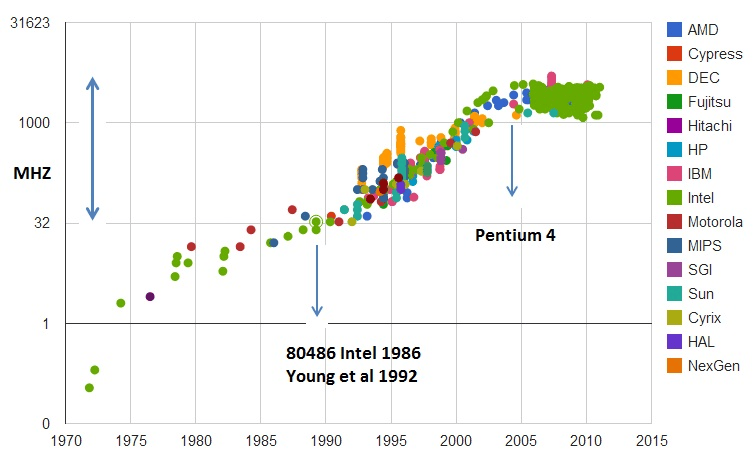

CPU的主频变化，在奔腾4时代进入了瓶颈期。

奔腾 4 的主频为什么没能超过 3.8GHz 的障碍呢？答案就是功耗问题。

### 并行优化，理解阿姆达尔定律


# 原理篇：指令和运算

## 5 计算机指令：试试用纸带编程

“打孔卡（Punched Card）”


### 在软硬件接口中，CPU做了什么事？


从软件工程师的角度来讲，CPU 就是一个执行各种**计算机指令**（Instruction Code）的逻辑机器。这里的计算机指令，就好比一门 CPU 能够听得懂的语言，我们也可以把它叫作**机器语言**（Machine Language）。

**==计算机指令集（Instruction Set）==**


### 从编译到汇编，代码怎么变成机器码？


```c
// test.c
int main()
{
  int a = 1; 
  int b = 2;
  a = a + b;
}
```


```c
test.o:     file format elf64-x86-64
Disassembly of section .text:
0000000000000000 <main>:
int main()
{
   0:   55                      push   rbp
   1:   48 89 e5                mov    rbp,rsp
  int a = 1; 
   4:   c7 45 fc 01 00 00 00    mov    DWORD PTR [rbp-0x4],0x1
  int b = 2;
   b:   c7 45 f8 02 00 00 00    mov    DWORD PTR [rbp-0x8],0x2
  a = a + b;
  12:   8b 45 f8                mov    eax,DWORD PTR [rbp-0x8]
  15:   01 45 fc                add    DWORD PTR [rbp-0x4],eax
}
  18:   5d                      pop    rbp
  19:   c3                      ret    
```


### 解析指令和机器码


常见的指令可以分成五大类：

- 第一类是==算术类指令==。我们的加减乘除，在 CPU 层面，都会变成一条条算术类指令。
- 第二类是==数据传输类指令==。给变量赋值、在内存里读写数据，用的都是数据传输类指令。
- 第三类是==逻辑类指令==。逻辑上的与或非，都是这一类指令。
- 第四类是==条件分支类指令==。日常我们写的“if/else”，其实都是条件分支类指令。
- 最后一类是==无条件跳转指令==。写一些大一点的程序，我们常常需要写一些函数或者方法。在调用函数的时候，其实就是发起了一个无条件跳转指令。

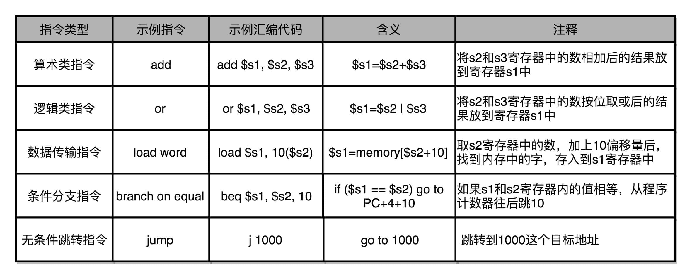


MIPS 指令集

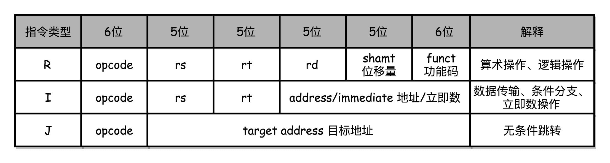

## 6 指令跳转：原来if...else就是goto

### CPU 是如何执行指令的？


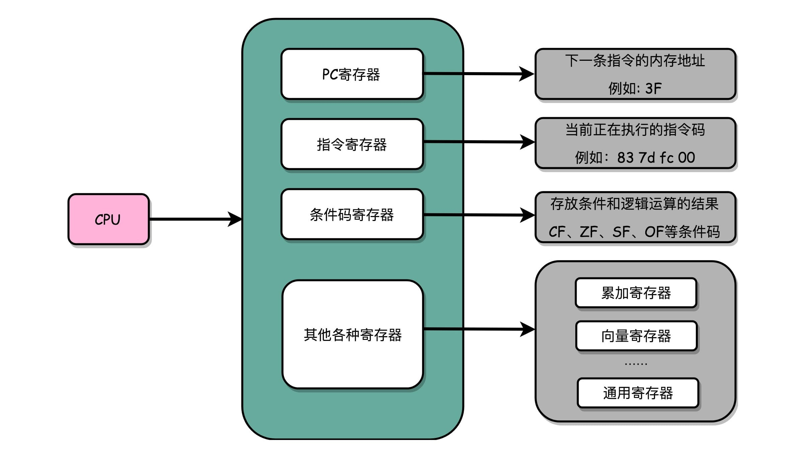

一个 CPU 里面会有很多种不同功能的寄存器。三个比较特殊的：

- ==PC寄存器==（Program Counter Register），我们也叫指令地址寄存器（Instruction Address Register）。顾名思义，它就是用来存放下一条需要执行的计算机指令的内存地址。
- ==指令寄存器==（Instruction Register），用来存放当前正在执行的指令。
- ==条件码寄存器==（Status Register），用里面的一个一个标记位（Flag），存放 CPU 进行算术或者逻辑计算的结果。

有些寄存器既可以存放数据，又能存放地址，我们就叫它==通用寄存器==。


## 7 函数调用：为什么会发生stack overflow？

### 为什么需要程序栈？


### 如何构造一个 stack overflow？


### 如何利用函数内联进行性能优化？


叶子函数（或叶子过程）


## 8 ELF和静态链接：为什么程序无法同时在Linux和Windows下运行？

### 编译、链接和装载：拆解程序执行


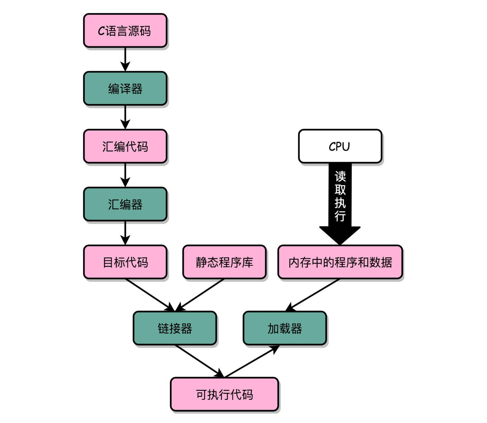

### ELF格式和链接：理解链接过程


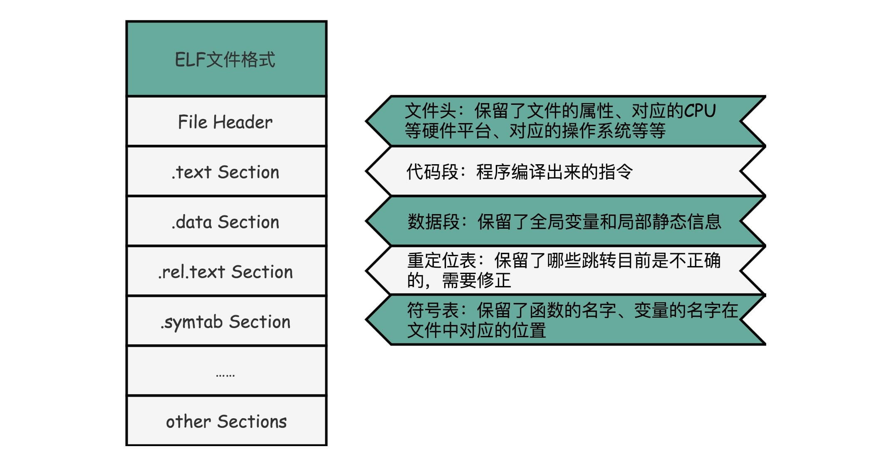

ELF 文件格式把各种信息，分成一个一个的 Section 保存起来。ELF 有一个基本的文件头（File Header），用来表示这个文件的基本属性，比如是否是可执行文件，对应的 CPU、操作系统等等。除了这些基本属性之外，大部分程序还有这么一些 Section：

1. 首先是.text Section，也叫作**代码段**或者指令段（Code Section），用来保存程序的代码和指令；
2. 接着是.data Section，也叫作**数据段**（Data Section），用来保存程序里面设置好的初始化数据信息；
3. 然后就是.rel.text Secion，叫作**重定位表**（Relocation Table）。重定位表里，保留的是当前的文件里面，哪些跳转地址其实是我们不知道的。比如上面的 link_example.o 里面，我们在 main 函数里面调用了 add 和 printf 这两个函数，但是在链接发生之前，我们并不知道该跳转到哪里，这些信息就会存储在重定位表里；
4. 最后是.symtab Section，叫作**符号表**（Symbol Table）。符号表保留了我们所说的当前文件里面定义的函数名称和对应地址的地址簿。


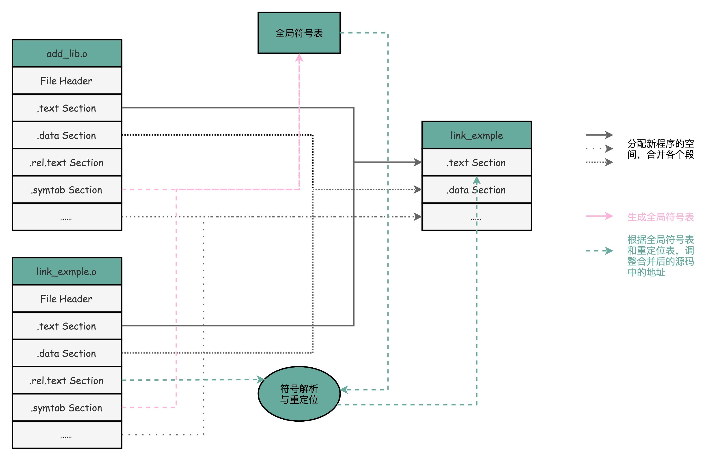

## 9 程序装载：“640K内存”真的不够用么？


# 原理篇：处理器


# 原理篇：存储和I/O系统


# 应用篇

理解了计算机各个组件的运作之后，最后一个模块将手把手带你实操。利用存储器层次结构设计大型 DMP 系统，并通过 Disruptor，跟你一起感受 CPU 的风驰电掣，让你真正学有所用。
