深入浅出计算机组成原理
----

https://time.geekbang.org/column/intro/170

发布时间：2019

在计算机专业十余门核心课程中，计算机组成原理是当之无愧的第一课。

无论想要**向上**学习计算机的底层知识，比如编译原理、操作系统、体系结构，还是想要**向下**学习数字电路、数字逻辑等内容，都要先掌握计算机组成原理。

学习计算机组成原理，就是通过指令、计算、CPU、存储系统和 I/O，掌握整个计算机运作过程的核心知识点；通过拆解程序的执行过程，对计算机系统有一个全貌的了解。


# 入门篇

学什么、怎么学、有什么用。

## 0 为什么你需要学习计算机组成原理？

徐文浩，一个正在创业的工程师。目前主要是通过自然语言处理技术，为走向海外的中国企业提供英语的智能客服和社交网络营销服务。

2005 年从上海交通大学计算机系毕业之后，我一直以写代码为生。如果从 7 岁第一次在少年宫写程序开始算起，到今天，我的码龄快有 30 岁了。这些年里，我在 Trilogy Software 写过各种大型企业软件；在 MediaV 这样的广告科技公司，从零开始搭建过支撑每天百亿流量的广告算法系统；2015 年，我又加入了拼多多，参与重写拼多多的交易系统。

这么多年一直在开发软件，我深感软件这个行业变化太快了。语言上，十年前流行 Java，这两年流行 Go；框架上，前两年流行 TensorFlow，最近又流行 PyTorch。我逐渐发现，学习应用层的各种语言、框架，好比在练拳法招式，可以短期给予你回报，而**深入学习“底层知识”，就是在练扎马步、核心肌肉力量，是在提升你自己的“根骨”和“资质”**。

> 如果越早去弄清楚计算机的底层原理，在你的知识体系中“储蓄”起这些知识，也就意味着你有越长的时间来收获学习知识的“利息”。虽然一开始可能不起眼，但是随着时间带来的复利效应，你的长线投资项目，就能让你在成长的过程中越走越快。

### 计算机底层知识的“第一课”

计算机是由 CPU、内存、显示器这些设备组成的硬件，但是，计算机系的学生毕业之后，大部分却都是从事各种软件开发工作。显然，在硬件和软件之间需要一座桥梁，而“计算机组成原理”就扮演了这样一个角色，它既==隔离==了软件和硬件，也提供了让软件无需关心硬件，就能直接操作硬件的==接口==。


### 理论和实践相结合


相关书籍读不下去的原因：

1. **广**。组成原理中的概念非常多，每个概念的信息量也非常大。比如想要理解 CPU 中的算术逻辑单元（也就是 ALU）是怎么实现加法的，需要牵涉到如何把整数表示成二进制，还需要了解这些表示背后的电路、逻辑门、CPU 时钟、触发器等知识。
2. **深**。组成原理中的很多概念，阐述开来就是计算机学科的另外一门核心课程。比如，计算机的指令是怎么从你写的 C、Java 这样的高级语言，变成计算机可以执行的机器码的？如果我们展开并深入讲解这个问题，就会变成《编译原理》这样一门核心课程。
3. **学不能致用**。学东西是要拿来用的，但因为这门课本身的属性，很多人在学习时，常常沉溺于概念和理论中，无法和自己日常的开发工作联系起来，以此来解决工作中遇到的问题，所以，学习往往没有成就感，就很难有动力坚持下去。

## 1  冯·诺依曼体系结构：计算机组成的金字塔

### 计算机的基本硬件组成

三大件：==CPU、内存和主板==

主板是一个有着各种各样，有时候多达数十乃至上百个插槽的配件。

CPU 要插在主板上，内存也要插在主板上。主板的==芯片组（Chipset）==和==总线（Bus）==解决了 CPU 和内存之间如何通信的问题。芯片组控制了数据传输的流转，也就是数据从哪里到哪里的问题。总线则是实际数据传输的高速公路。因此，==总线速度（Bus Speed）==决定了数据能传输得多快。


显卡（Graphics Card） 

GPU（Graphics Processing Unit，图形处理器）


南桥（SouthBridge）芯片组控制鼠标、键盘以及硬盘这些外部设备和 CPU 之间的通信。

“北桥”芯片，以前用来作为“桥”，连接 CPU 和内存、显卡之间的通信。不过，随着时间的变迁，现在的主板上的“北桥”芯片的工作，已经被移到了 CPU 的内部了。

### 冯·诺依曼体系结构

因为手机尺寸的原因，手机制造商们选择把 CPU、内存、网络通信，乃至摄像头芯片，都封装到一个芯片，然后再嵌入到手机主板上。这种方式叫 ==SoC==，也就是 System on a Chip（系统芯片）。

无论是个人电脑、服务器、智能手机，还是 Raspberry Pi 这样的微型卡片机，都遵循着同一个“计算机”的抽象概念，就是==冯·诺依曼体系结构==（Von Neumann architecture），也叫==存储程序计算机==。

存储程序计算机暗含了两个概念：一个是“==可编程==”计算机，一个是“==存储==”计算机。

“不可编程”：计算机是由各种门电路组合而成的，然后通过组装出一个固定的电路板，来完成一个特定的计算程序。一旦需要修改功能，就要重新组装电路。（程序在计算机硬件层面是“写死”的）

最常见的就是老式计算器，电路板设好了加减乘除，做不了任何计算逻辑固定之外的事情。

“存储”表示程序本身是存储在计算机的内存里，可以通过加载不同的程序来解决不同的问题。

> 早年的“Plugboard”这样的插线板式的计算机就是不能存储的。

冯祖师爷，[First Draft of a Report on the EDVAC](https://en.wikipedia.org/wiki/First_Draft_of_a_Report_on_the_EDVAC)（**First Draft**，《第一份草案》），描述了计算机组成。

> 任何一台计算机的任何一个部件都可以归到运算器、控制器、存储器、输入设备和输出设备中，而所有的现代计算机也都是基于这个基础架构来设计开发的。

而所有的计算机程序，也都可以抽象为从**输入设备**读取输入信息，通过**运算器**和**控制器**来执行存储在**存储器**里的程序，最终把结果输出到**输出设备**中。而我们所有撰写的无论高级还是低级语言的程序，也都是基于这样一个抽象框架来进行运作的。


## 2 计算机组成原理知识地图


五大基本**组件运算器、控制器、存储器、输入设备和输出设备**。

计算机的两个核心指标，==性能和功耗==。


浮点数（Floating Point）

==CPU时钟==可以用来构造寄存器和内存的锁存器和触发器。

### 入门书籍

《计算机是怎样跑起来的》

《程序是怎样跑起来的》入门微缩版本的“计算机组成原理”。

北京大学免费公开课[《Computer Organization》](https://www.coursera.org/learn/jisuanji-zucheng)：硬件层面的基础实现，比如寄存器、ALU 这些电路是怎么回事

### 深入学习书籍

《计算机组成与设计：硬件 / 软件接口》

《深入理解计算机系统》  https://www.bilibili.com/video/av24540152/

自操作系统大神塔能鲍姆（Andrew S. Tanenbaum）的《计算机组成：结构化方法》，适合作为一个辅助的参考书

《计算机体系结构：量化研究方法》

### 课外阅读

对于资深程序员来说，来自 Redhat 的 What Every Programmer Should Know About Memory 是写出高性能程序不可不读的经典材料

《编码：隐匿在计算机软硬件背后的语言》和《程序员的自我修养：链接、装载和库》是理解计算机硬件和操作系统层面代码执行的优秀阅读材料。

## 3 CPU主频——“性能”究竟是什么？

### 什么是性能？时间的倒数

计算机的性能衡量的两个指标：

- **响应时间**（Response time）或者叫执行时间（Execution time）【“跑得更快”】


- 吞吐率（Throughput）或者带宽（Bandwidth）【“搬得更多”】


==响应时间==指的就是，我们执行一个程序，到底需要花多少时间。花的时间越少，自然性能就越好。

==吞吐率==是指在一定的时间范围内，到底能处理多少事情。这里的“事情”，在计算机里就是处理的数据或者执行的程序指令。

缩短程序的响应时间，一般来说都会提升吞吐率。

除了缩短响应时间，还可以多找几个人一起来搬，这就类似现代的服务器都是 8核、16核的。人多力量大，同时处理数据，在单位时间内就可以处理更多数据，吞吐率自然也就上去了。

响应时间的提升没那么容易，不能像吞吐率那样添加硬件。

一般把性能，定义成响应时间的倒数，也就是：

`性能 = 1/响应时间`

过去几年流行的手机跑分软件，就是把多个预设好的程序在手机上运行，然后根据运行需要的时间，算出一个分数来给出手机的性能评估。而在业界，各大 CPU 和服务器厂商组织了一个叫作 **SPEC**（Standard Performance Evaluation Corporation）的第三方机构，专门用来指定各种“跑分”的规则。

SPEC 提供的 CPU 基准测试程序，就好像 CPU 届的“高考”，通过数十个不同的计算程序，对于 CPU 的性能给出一个最终评分。这些程序丰富多彩，有编译器、解释器、视频压缩、人工智能国际象棋等等，涵盖了方方面面的应用场景。https://www.spec.org/cpu2017/results/cpu2017.html

### 计算机的计时单位：CPU时钟

用时间作为衡量性能的指标，有两个问题。

#### 第一个就是时间不“准”。

统计时间是用类似于“掐秒表”一样，记录程序运行结束的时间减去程序开始运行的时间。这个时间也叫 **==Wall Clock Time==** 或者 **Elapsed Time**，就是在运行程序期间，挂在墙上的钟走掉的时间。

但是，计算机可能同时运行着好多个程序，CPU实际上不停地在各个程序之间进行**切**换。在这些走掉的时间里面，很可能CPU切换去运行别的程序了。而且，有些程序在运行的时候，可能要**从网络、硬盘去读取数据，要等网络和硬盘把数据读出来**，给到内存和CPU。所以说，要想准确统计某个程序运行时间，进而去比较两个程序的实际性能，我们得把这些时间给**刨除**掉。

Linux下的time命令：

```shell
time seq 1000000 | wc -l
1000000

real 0m0.101s
user 0m0.031s
sys  0m0.016s
```

- real time，就是 Wall Clock Time，也就是运行程序整个过程中流逝掉的时间；
- user time，也就是 CPU 在运行你的程序，在用户态运行指令的时间；
- sys time，是 CPU 在运行你的程序，在操作系统内核里运行指令的时间。

而程序实际花费的 **==CPU执行时间（CPU Time）==，就是 user time 加上 sys time**。

上面例子中，实际上程序用了 0.101s，但是 CPU time 只有 0.031+0.016 = 0.047s。运行程序的时间里，只有不到一半是实际花在这个程序上的。

程序实际占用的CPU时间一般比Elapsed Time要少不少：


> 备注：最好在云平台上，找一台 1 CPU 的机器来跑这个命令，在多 CPU 的机器上，seq 和 wc 两个命令可能分配到不同的 CPU 上，我们拿到的 user time 和 sys time 是两个 CPU 上花费的时间之和，可能会导致 real time 可能会小于 user time+sys time。


其次，即使我们已经拿到了 CPU 时间，我们也不一定可以直接“比较”出两个程序的性能差异。即使在同一台计算机上，CPU可能满载运行也可能**降频**运行，降频运行的时候自然花的时间会多一些。

除了 CPU 之外，时间这个性能指标还会受到主板、内存这些其他相**关硬件**的影响。所以，我们需要对“时间”这个我们可以感知的指标进行拆解，把程序的 CPU 执行时间变成 ==CPU时钟周期数（CPU Cycles）==和 ==时钟周期时间（Clock Cycle）==的乘积。

```
程序的CPU执行时间 = CPU时钟周期数 x 时钟周期时间
```

> Intel Core-i7-7700HQ 2.8GHz，这里的 2.8GHz 就是电脑CPU的==主频（Frequency/Clock Rate）==，可以先粗浅地认为，CPU 在 1 秒时间内，可以执行的简单指令的数量是 2.8G 条。
>
> 更准确一点描述，这个 2.8GHz 就代表CPU的一个“钟表”能够识别出来的最小的时间间隔。就像我们挂在墙上的挂钟，都是“滴答滴答”一秒一秒地走，所以通过墙上的挂钟能够识别出来的最小时间单位就是秒。
>
> 而在 CPU 内部，和我们平时戴的电子石英表类似，有一个叫==晶体振荡器（Oscillator Crystal）==的东西，简称为==晶振==。我们把晶振当成CPU内部的电子表来使用。晶振带来的每一次“滴答”，就是==时钟周期时间==。
>
> 对应的，2.8GHz的CPU上，时钟周期时间就是1/2.8G。
>
> “==超频==”其实就相当于把买回来的 CPU 内部的钟给调快了，于是 CPU 的计算跟着这个时钟的节奏，也就自然变快了。当然这个快不是没有代价的，CPU 跑得越快，散热的压力也就越大。就和人一样，超过生理极限，CPU 就会崩溃了。

最简单的提升性能方案，自然缩短时钟周期时间，也就是提升主频。但这是软件工程师控制不了的事情。

如果能够减少程序需要的 CPU时钟周期数量，一样能够提升程序性能。


CPU时钟周期数 可以分解 “指令数 × 每条指令的平均时钟周期数（Cycles Per Instruction，简称 ==CPI==）“。上面的公式变为：

```
程序的CPU执行时间 = 指令数 × CPI × Clock Cycle Time
```

想要解决性能问题，其实就是要优化这三者:

1. 时钟周期时间，就是计算机主频。
2. 每条指令的平均时钟周期数 CPI，就是一条指令到底需要多少 CPU Cycle。
3. 指令数，代表执行我们的程序到底需要多少条指令、用哪些指令。这个很多时候就把挑战交给了编译器。同样的代码，编译成计算机指令时候，就有各种不同的表示方式。

> 我们可以把自己想象成一个 CPU，坐在那里写程序。计算机主频就好像是你的打字速度，打字越快，你自然可以多写一点程序。CPI 相当于你在写程序的时候，熟悉各种快捷键，越是打同样的内容，需要敲击键盘的次数就越少。指令数相当于你的程序设计得够合理，同样的程序要写的代码行数就少。如果三者皆能实现，你自然可以很快地写出一个优秀的程序，你的“性能”从外面来看就是好的。


一个程序对应多条语句，一条编程语句可能对应多条指令，一条CPU指令可能需要多个CPU周期才能完成。


### 思考题

> 每次有新手机发布的时候，总会有一些对于手机的跑分结果的议论。乃至于有“作弊”跑分或者“针对跑分优化”的说法。我们能针对“跑分”作弊么？怎么做到呢？“作弊”出来的分数对于手机性能还有参考意义么？


## 4 穿越功耗墙，我们该从哪些方面提升“性能”？

如果要提升计算机的性能，我们可以从指令数、CPI以及CPU主频这三个地方入手。

指令数、CPI不怎么好弄，就针对CPU，在 CPU 上多放一点晶体管，不断提升 CPU的时钟频率，这样就能让CPU变得更快，程序的执行时间就会缩短。

### 功耗：CPU 的“人体极限”


相较于 1978 年到 2000 年，这 20 年里 300 倍的主频提升，从 2000 年到现在的这 19 年，CPU 的主频大概提高了 3 倍。


奔腾 4 的主频为什么没能超过 3.8GHz 的障碍呢？答案就是==功耗==问题。

> 例子：
>
> 一个 3.8GHz 的奔腾 4 处理器，满载功率是 130 瓦。这个 130 瓦是什么概念呢？机场允许带上飞机的充电宝的容量上限是 100 瓦时。如果我们把这个 CPU 安在手机里面，不考虑屏幕内存之类的耗电，这个 CPU 满载运行 45 分钟，充电宝里面就没电了。而 iPhone X 使用 ARM 架构的 CPU，功率则只有 4.5 瓦左右。

CPU一般都被叫作**超大规模集成电路（Very-Large-Scale Integration，VLSI）**。这些电路，实际上都是一个个晶体管组合而成的。CPU 在计算，其实就是让晶体管里面的“开关”不断地去“打开”和“关闭”，来组合完成各种运算和功能。

想要计算得快，一方面，我们要在 CPU 里，同样的面积里面，多放一些晶体管，也就是==增加密度==；另一方面，我们要让晶体管“打开”和“关闭”得更快一点，也就是==提升主频==。而这两者，都会增加功耗，带来耗电和散热的问题。

> 例子：
>
> 可以把一个计算机 CPU 想象成一个巨大的工厂，里面有很多工人，相当于 CPU 上面的晶体管，互相之间协同工作。
>
> 为了工作得快一点，我们要在工厂里多塞一点人。你可能会问，为什么不把工厂造得大一点呢？这是因为，人和人之间如果离得远了，互相之间走过去需要花的时间就会变长，这也会导致性能下降。这就好像如果 CPU 的面积大，晶体管之间的距离变大，电信号传输的时间就会变长，运算速度自然就慢了。
>
> 除了多塞一点人，我们还希望每个人的动作都快一点，这样同样的时间里就可以多干一点活儿了。这就相当于提升 CPU 主频，但是动作快，每个人就要出汗散热。要是太热了，对工厂里面的人来说会中暑生病，对CPU来说就会崩溃出错。

我们会在 CPU 上面抹硅脂、装风扇，乃至用上水冷或者其他更好的散热设备，就好像在工厂里面装风扇、空调，发冷饮一样。但是同样的空间下，装上风扇空调能够带来的散热效果也是有极限的。

因此，在 CPU 里面，能够放下的**晶体管数量和晶体管的“开关”频率也都是有限的**。一个 CPU 的功率可以用一个公式来表示：

```
功耗 ~= 1/2 × 负载电容 × 电压的平方 × 开关频率 × 晶体管数量
```

那么，为了要提升性能，我们需要不断地增加晶体管数量。同样的面积下，我们想要多放一点晶体管，就要把晶体管造得小一点。这个就是平时我们所说的提升“==制程==”。从 28nm 到 7nm，相当于晶体管本身变成了原来的 1/4 大小。这个就相当于我们在工厂里，同样的活儿，我们要找瘦小一点的工人，这样一个工厂里面就可以多一些人。我们还要提升主频，让开关的频率变快，也就是要找手脚更快的工人。


但是，**功耗增加太多，就会导致CPU散热跟不上**，这时，我们就需要降低电压。这里有一点非常关键，在整个功耗的公式里面，==功耗和电压的平方是成正比的==。这意味着电压下降到原来的 1/5，整个的功耗会变成原来的 1/25。

事实上，从 5MHz 主频的 8086 到 5GHz 主频的 Intel i9，CPU 的电压已经从 5V 左右下降到了 1V 左右。这也是为什么我们 CPU 的主频提升了 1000 倍，但是功耗只增长了 40 倍。比如说，我写这篇文章用的是 Surface Go，在这样的轻薄笔记本上，微软就是选择了把电压下降到 0.25V 的低电压 CPU，使得笔记本能有更长的续航时间。

### 并行优化，理解阿姆达尔定律

提升响应时间，就好比提升你用的交通工具的速度，比如原本你是开汽车，现在变成了火车乃至飞机。本来开车从上海到北京要 20 个小时，换成飞机就只要 2 个小时了，但是，在此之上，再想要提升速度就不太容易了。我们的 CPU 在奔腾 4 的年代，就好比已经到了飞机这个速度极限。

那你可能要问了，接下来该怎么办呢？相比于给飞机提速，工程师们又想到了新的办法，可以一次同时开 2 架、4 架乃至 8 架飞机，这就好像我们现在用的 2 核、4 核，乃至 8 核的 CPU。

虽然从上海到北京的时间没有变，但是一次飞 8 架飞机能够运的东西自然就变多了，也就是所谓的“吞吐率”变大了。所以，不管你有没有需要，现在 CPU 的性能就是提升了 2 倍乃至 8 倍、16 倍。这也是一个最常见的提升性能的方式，==通过并行提高性能==。

这个思想在很多地方都可以使用。举个例子，我们做机器学习程序的时候，需要计算向量的点积，比如向量 W=[W0,W1,W2,…,W15] 和向量 X=[X0,X1,X2,…,X15]，W⋅X=W0∗X0+W1∗X1+ W2∗X2+…+W15∗X15。这些式子由 16 个乘法和 1 个连加组成。如果你自己一个人用笔来算的话，需要一步一步算 16 次乘法和 15 次加法。如果这个时候我们把这个任务分配给 4 个人，同时去算 W0～W3, W4～W7, W8～W11, W12～W15 这样四个部分的结果，再由一个人进行汇总，需要的时间就会缩短。


但是，并不是所有问题，都可以通过并行提高性能来解决。如果想要使用这种思想，需要满足这样几个条件。

- 第一，需要进行的计算，本身可以分解成几个可以并行的任务。好比上面的乘法和加法计算，几个人可以同时进行，不会影响最后的结果。
- 第二，需要能够分解好问题，并确保几个人的结果能够汇总到一起。
- 第三，在“汇总”这个阶段，是没有办法并行进行的，还是得顺序执行，一步一步来。

这就引出了在进行性能优化中，常常用到的一个经验定律，**==阿姆达尔定律（Amdahl’s Law）==**：对于一个程序进行优化之后，处理器并行运算之后效率提升的情况。公式表示：

```
优化后的执行时间 = 受优化影响的执行时间 / 加速倍数 + 不受影响的执行时间
```

在刚刚的向量点积例子里，4 个人同时计算向量的一小段点积，就是通过并行提高了这部分的计算性能。但是，这 4 个人的计算结果，最终还是要在一个人那里进行汇总相加。这部分汇总相加的时间，是不能通过并行来优化的，也就是上面的公式里面**不受影响的执行时间**这一部分。

比如上面的各个向量的一小段的点积，需要 100ns，加法需要 20ns，总共需要 120ns。这里通过并行 4 个 CPU 有了 4 倍的加速度。那么最终优化后，就有了 100/4+20=45ns。即使我们增加更多的并行度来提供加速倍数，比如有 100 个 CPU，整个时间也需要 100/100+20=21ns。


### 总结


# 原理篇：指令和运算

## 5 计算机指令：试试用纸带编程

“打孔卡（Punched Card）”

上世纪60年代晚期或70年代初期，Arnold Reinold拍摄的FORTRAN计算程序的穿孔卡照片：


### 在软硬件接口中，CPU做了什么事？

CPU,Central Processing Unit，中央处理器。

从硬件的角度来看，CPU 就是一个超大规模集成电路，通过电路实现了加法、乘法乃至各种各样的处理逻辑。

从软件工程师的角度来讲，CPU 就是一个执行各种**计算机指令**（Instruction Code）的逻辑机器。这里的计算机指令，就好比一门 CPU 能够听得懂的语言，我们也可以把它叫作**机器语言**（Machine Language）。

不同的CPU有各自支持的“语言”，就是不同**==计算机指令集（Instruction Set）==**。

一个计算机程序，不可能只有一条指令，而是由成千上万条指令组成的。但是 CPU 里不能一直放着所有指令，所以计算机程序平时是存储在存储器中的。这种程序指令存储在存储器里面的计算机，就叫作==存储程序型计算机（Stored-program Computer）==。

> 非存储程序型计算机：早就发明了一种叫 Plugboard Computer 的计算设备。我把它直译成“插线板计算机”。在一个布满了各种插口和插座的板子上，工程师们用不同的电线来连接不同的插口和插座，从而来完成各种计算任务。
>
> 


### 从编译到汇编，代码怎么变成机器码？


```c
// test.c
int main()
{
  int a = 1; 
  int b = 2;
  a = a + b;
}
```

要让这段程序在一个Linux操作系统上跑起来，需要把整个程序翻译成一个==汇编语言（ASM，Assembly Language）==的程序，这个过程一般叫**编译（Compile）成汇编代码**。

可以再用==汇编器（Assembler）==翻译成==机器码（Machine Code）==。这些机器码由“0”和“1”组成的机器语言表示。这一条条机器码，就是一条条的==计算机指令==。这样一串串的 16 进制数字，就是CPU能够真正认识的计算机指令。

Linux中可以使用`gcc`（GCC，GUC编译器套装，GNU Compiler Collectipon）和`objdump`把对应的汇编代码和机器码都打印出来：

```shell
$ gcc -g -c test.c
$ objdump -d -M intel -S test.o 

test.o：     文件格式 elf64-littleaarch64


Disassembly of section .text:

0000000000000000 <main>:
// test.c
int main()
{
   0:   objdump: unrecognised disassembler option: intel
d10043ff        sub     sp, sp, #0x10
  int a = 1; 
   4:   52800020        mov     w0, #0x1                        // #1
   8:   b9000fe0        str     w0, [sp, #12]
  int b = 2;
   c:   52800040        mov     w0, #0x2                        // #2
  10:   b9000be0        str     w0, [sp, #8]
  a = a + b;
  14:   b9400fe1        ldr     w1, [sp, #12]
  18:   b9400be0        ldr     w0, [sp, #8]
  1c:   0b000020        add     w0, w1, w0
  20:   b9000fe0        str     w0, [sp, #12]
  24:   52800000        mov     w0, #0x0                        // #0
}
  28:   910043ff        add     sp, sp, #0x10
  2c:   d65f03c0        ret
```

左侧有一堆数字，这些就是一条条机器码；右边有一系列的 push、mov、add、pop 等，这些就是对应的汇编代码。

一行 C 语言代码，有时候只对应一条机器码和汇编代码，有时候则是对应两条机器码和汇编代码。

汇编代码和机器码之间是一一对应的。

> 可以直接把代码编译成机器码呀，为什么还需要汇编代码呢？
>
> 因为汇编代码其实就是“给程序员看的机器码”，也正因为这样，机器码和汇编代码是一一对应的。


```
高级语言  ->  汇编代码  ->  机器码  -->  CPU可以执行的计算机指令
```


### 解析指令和机器码

日常用的 Intel CPU，有 2000 条左右的 CPU指令。

常见的指令可以分成五大类：

- 第一类是==算术类指令==。加减乘除，在CPU层面，都会变成一条条算术类指令。
- 第二类是==数据传输类指令==。给变量赋值、在内存里读写数据，用的都是数据传输类指令。
- 第三类是==逻辑类指令==。逻辑上的与或非，都是这一类指令。
- 第四类是==条件分支类指令==。日常写的“if/else”，其实都是条件分支类指令。
- 最后一类是==无条件跳转指令==。写一些大一点的程序，我们常常需要写一些函数或者方法。在调用函数的时候，其实就是发起了一个无条件跳转指令。


> 汇编器是怎么把对应的汇编代码，翻译成为机器码的？

不同的 CPU 有不同的指令集，也就对应着不同的汇编语言和不同的机器码。以最简单的MIPS指令集为例。

MIPS 是一组由 MIPS 技术公司在 80 年代中期设计出来的 CPU 指令集。就在最近，MIPS 公司把整个指令集和芯片架构都完全开源了。https://www.mips.com/mipsopen/


MIPS 的指令是一个32位的整数，高6位叫==操作码（Opcode）==，也就是代表这条指令具体是一条什么样的指令，剩下的 26 位有三种格式，分别是 R、I 和 J。

- ==R指令==是一般用来做算术和逻辑操作，里面有读取和写入数据的寄存器的地址。如果是逻辑位移操作，后面还有位移操作的位移量，而最后的功能码，则是在前面的操作码不够的时候，扩展操作码表示对应的具体指令的。
- ==I指令==，则通常是用在数据传输、条件分支，以及在运算的时候使用的并非变量还是常数的时候。这个时候，没有了位移量和操作码，也没有了第三个寄存器，而是把这三部分直接合并成了一个地址值或者一个常数。
- ==J指令==就是一个跳转指令，高 6 位之外的 26 位都是一个跳转后的地址。

```
add $t0,$s2,$s1
```

以上面一个简单的加法算术指令为例：【下面都用十进制来表示对应的代码】

对应的 MIPS 指令里 opcode 是 0，rs 代表第一个寄存器 s1 的地址是 17，rt 代表第二个寄存器 s2 的地址是 18，rd 代表目标的临时寄存器 t0 的地址，是 8。因为不是位移操作，所以位移量是 0。把这些数字拼在一起，就变成了一个 MIPS 的加法指令。


回到打孔带。如果用打孔代表 1，没有打孔代表 0，用 4 行 8 列代表一条指令来打一个穿孔纸带，那么这条命令大概就长这样：


```
这里的转换关系如下： 
opcode(6位) 000000 10001 10010 01000 00000 100000 = 0000 0010 0011 0010 0100 0000 0010 0000（对应纵向打孔带） =0X02324020
```


## 6 指令跳转：原来if...else就是goto

上一节说明了，一个计算机程序是怎么被分解成一条条指令来执行的。

### CPU是如何执行指令的？

一般Intel CPU里面差不多有几百亿个晶体管。实际上，一条条计算机指令执行起来非常复杂。

好在 CPU 在软件层面已经做好了封装。对于做软件的程序员来说，只要知道，写好的代码变成了指令之后，是一条一条**顺序**执行的就可以了。

先不管几百亿的晶体管的背后是怎么通过电路运转起来的，逻辑上，可以认为，CPU 其实就是由一堆**寄存器组**成的。而寄存器就是CPU内部，由多个==**触发器==（Flip-Flop）或者==锁存器==（Latches）**组成的简单电路。

触发器和锁存器，其实就是两种不同原理的数字电路组成的**==逻辑门==**。（数字电路的相关教程🔖）

**N个触发器或者锁存器，就可以组成一个N位（Bit）的寄存器，能够保存N位的数据**。比方说，我们用的64位Intel服务器，寄存器就是64位的。


一个 CPU 里面会有很多种不同功能的寄存器。三个比较特殊的：

- ==PC寄存器==（Program Counter Register），我们也叫指令地址寄存器（Instruction Address Register）。顾名思义，它就是用来存放下一条需要执行的计算机指令的内存地址。
- ==指令寄存器==（Instruction Register），用来存放当前正在执行的指令。
- ==条件码寄存器==（Status Register），用里面的一个一个标记位（Flag），存放CPU进行算术或者逻辑计算的结果。

有些寄存器既可以存放数据，又能存放地址，我们就叫它==通用寄存器==。

实际上，一个程序执行的时候，CPU会根据PC寄存器里的地址，从内存里面把需要执行的指令读取到指令寄存器里面执行，然后根据指令长度自增，开始顺序读取下一条指令。可以看到，一个程序的一条条指令，在内存里面是连续保存的，也会一条条顺序加载。

而有些特殊指令，比如上一节的**J类指令**，也就是**跳转指令**，会修改 PC 寄存器里面的地址值。这样，下一条要执行的指令就不是从内存里面顺序加载的了。事实上，这些跳转指令的存在，也是我们可以在写程序的时候，使用 if…else 条件语句和 while/for 循环语句的原因。

### 从 if…else 来看程序的执行和跳转

```c
// test.c

#include <time.h>
#include <stdlib.h>

int main()
{
  srand(time(NULL));
  int r = rand() % 2;
  int a = 10;
  if (r == 0)
  {
    a = 1;
  } else {
    a = 2;
  }
}
```

if…else 条件判断语句对应的汇编代码：

```c
    if (r == 0)
  3b:   83 7d fc 00             cmp    DWORD PTR [rbp-0x4],0x0
  3f:   75 09                   jne    4a <main+0x4a>
    {
        a = 1;
  41:   c7 45 f8 01 00 00 00    mov    DWORD PTR [rbp-0x8],0x1
  48:   eb 07                   jmp    51 <main+0x51>
    }
    else
    {
        a = 2;
  4a:   c7 45 f8 02 00 00 00    mov    DWORD PTR [rbp-0x8],0x2
  51:   b8 00 00 00 00          mov    eax,0x0
    } 
```

r == 0 的条件判断，被编译成了 cmp 和 jne 这两条指令。

`cmp` 指令比较了前后两个操作数的值，这里的 `DWORD PTR` 代表操作的数据类型是 32 位的整数，而`[rbp-0x4]`则是变量 r 的内存地址。所以，第一个操作数就是从内存里拿到的变量 r 的值。第二个操作数 `0x0` 就是我们设定的常量 0 的 16 进制表示。cmp 指令的比较结果，会存入到**条件码寄存器**当中去。

> 在这里，如果比较的结果是 True，也就是 r == 0，就把==零标志条件码==（对应的条件码是 ZF，Zero Flag）设置为 1。除了零标志之外，Intel 的 CPU 下还有==进位标志==（CF，Carry Flag）、==符号标志==（SF，Sign Flag）以及==溢出标志==（OF，Overflow Flag），用在不同的判断条件下。

cmp 指令执行完成之后，PC 寄存器会自动自增，开始执行下一条 jne 的指令。

`jne`(条件转移指令,“jump if not equal”，“如果不相等则跳转”）会查看对应的零标志位。如果 ZF 为 1，说明上面的比较结果是 TRUE，如果是 ZF 是 0，也就是上面的比较结果是 False，会跳转到后面跟着的操作数 4a 的位置。这个 4a，对应这里汇编代码的行号，也就是上面设置的 else 条件里的第一条指令。当跳转发生的时候，PC 寄存器就不再是自增变成下一条指令的地址，而是被直接设置成这里的 4a 这个地址。这个时候，CPU 再把 4a 地址里的指令加载到指令寄存器中来执行。

跳转到执行地址为 `4a` 的指令，实际是一条 `mov` 指令，第一个操作数和前面的 cmp 指令一样，是另一个 32 位整型的内存地址，以及 2 的对应的 16 进制值 `0x2`。mov 指令把 2 设置到对应的内存里去，相当于一个赋值操作。然后，PC 寄存器里的值继续自增，执行下一条 mov 指令。

这条 mov 指令的第一个操作数 `eax`，代表**累加寄存器**，第二个操作数 0x0 则是 16 进制的 0 的表示。这条指令其实没有实际的作用，它的作用是一个占位符。我们回过头去看前面的 if 条件，如果满足的话，在赋值的 mov 指令执行完成之后，有一个 jmp 的无条件跳转指令。跳转的地址就是这一行的地址 51。我们的 main 函数没有设定返回值，而 mov eax, 0x0 其实就是给 main 函数生成了一个默认的为 0 的返回值到累加器里面。if 条件里面的内容执行完成之后也会跳转到这里，和 else 里的内容结束之后的位置是一样的。


上一讲我们讲打孔卡的时候说到，读取打孔卡的机器会顺序地一段一段地读取指令，然后执行。执行完一条指令，它会自动地顺序读取下一条指令。如果执行的当前指令带有跳转的地址，比如往后跳 10 个指令，那么机器会自动将卡片带往后移动 10 个指令的位置，再来执行指令。同样的，机器也能向前移动，去读取之前已经执行过的指令。这也就是我们的 while/for 循环实现的原理。


### 如何通过 if…else 和 goto 来实现循环？

```c
int main()
{
    int a = 0;
    for (int i = 0; i < 3; i++)
    {
        a += i;
    }
}
```


```c
    for (int i = 0; i <= 2; i++)
   b:   c7 45 f8 00 00 00 00    mov    DWORD PTR [rbp-0x4],0x0
  12:   eb 0a                   jmp    1e 
    {
        a += i;
  14:   8b 45 f8                mov    eax,DWORD PTR [rbp-0x4]
  17:   01 45 fc                add    DWORD PTR [rbp-0x8],eax

  1a:   83 45 f8 01             add    DWORD PTR [rbp-0x4],0x1
  1e:   83 7d f8 02             cmp    DWORD PTR [rbp-0x4],0x2
  22:   7e f0                   jle    14 
  24:   b8 00 00 00 00          mov    eax,0x0
    }
```

对应的循环也是用 `1e` 这个地址上的 cmp 比较指令，和紧接着的 `jle`（“jump if less or equal, or not greater”，意思是“如果小于或等于，或者不大于则转移”）条件跳转指令来实现的。主要的差别在于，这里的 jle 跳转的地址，在这条指令之前的地址 14，而非 if…else 编译出来的跳转指令之后。往前跳转使得条件满足的时候，PC 寄存器会把指令地址设置到之前执行过的指令位置，重新执行之前执行过的指令，直到条件不满足，顺序往下执行 jle 之后的指令，整个循环才结束。


如果你看一长条打孔卡的话，就会看到卡片往后移动一段，执行了之后，又反向移动，去重新执行前面的指令。

其实，你有没有觉得，jle 和 jmp 指令，有点像程序语言里面的 goto 命令，直接指定了一个特定条件下的跳转位置。虽然我们在用高级语言开发程序的时候反对使用 goto，但是实际在机器指令层面，无论是 if…else…也好，还是 for/while 也好，都是用和 goto 相同的跳转到特定指令位置的方式来实现的。

### 思考题

> 除了 if…else 的条件语句和 for/while 的循环之外，大部分编程语言还有 switch…case 这样的条件跳转语句。switch…case 编译出来的汇编代码也是这样使用 jne 指令进行跳转吗？对应的汇编代码的性能和写很多 if…else 有什么区别呢？

```c
int main() {
   0:   55                      push   rbp
   1:   48 89 e5                mov    rbp,rsp
   4:   48 83 ec 10             sub    rsp,0x10
    int day = 5;
   8:   c7 45 fc 05 00 00 00    mov    DWORD PTR [rbp-0x4],0x5

    switch (day) {
   f:   83 7d fc 07             cmp    DWORD PTR [rbp-0x4],0x7
  13:   77 61                   ja     76 <main+0x76>
  15:   8b 45 fc                mov    eax,DWORD PTR [rbp-0x4]
  18:   48 8b 04 c5 00 00 00    mov    rax,QWORD PTR [rax*8+0x0]
  1f:   00 
  20:   ff e0                   jmp    rax
    case 1:
        printf("Monday\n");
  22:   bf 00 00 00 00          mov    edi,0x0
  27:   e8 00 00 00 00          call   2c <main+0x2c>
        break;
  2c:   eb 53                   jmp    81 <main+0x81>
    case 2:
        printf("Tuesday\n");
  2e:   bf 00 00 00 00          mov    edi,0x0
  33:   e8 00 00 00 00          call   38 <main+0x38>
        break;
  38:   eb 47                   jmp    81 <main+0x81>

 // ....   
    
    default:
        printf("Invalid day\n");
  76:   bf 00 00 00 00          mov    edi,0x0
  7b:   e8 00 00 00 00          call   80 <main+0x80>
        break;
  80:   90                      nop
    }

    return 0;
  81:   b8 00 00 00 00          mov    eax,0x0
}
  86:   c9                      leave  
  87:   c3                      ret 
```


## 7 函数调用：为什么会发生stack overflow？

### 为什么需要程序栈？

```c
// function_example.c
#include <stdio.h>
int static add(int a, int b)
{
    return a+b;
}


int main()
{
    int x = 5;
    int y = 10;
    int u = add(x, y);
}
```


```c
int static add(int a, int b)
{
   0:   55                      push   rbp
   1:   48 89 e5                mov    rbp,rsp
   4:   89 7d fc                mov    DWORD PTR [rbp-0x4],edi
   7:   89 75 f8                mov    DWORD PTR [rbp-0x8],esi
    return a+b;
   a:   8b 55 fc                mov    edx,DWORD PTR [rbp-0x4]
   d:   8b 45 f8                mov    eax,DWORD PTR [rbp-0x8]
  10:   01 d0                   add    eax,edx
}
  12:   5d                      pop    rbp
  13:   c3                      ret    
0000000000000014 <main>:
int main()
{
  14:   55                      push   rbp
  15:   48 89 e5                mov    rbp,rsp
  18:   48 83 ec 10             sub    rsp,0x10
    int x = 5;
  1c:   c7 45 fc 05 00 00 00    mov    DWORD PTR [rbp-0x4],0x5
    int y = 10;
  23:   c7 45 f8 0a 00 00 00    mov    DWORD PTR [rbp-0x8],0xa
    int u = add(x, y);
  2a:   8b 55 f8                mov    edx,DWORD PTR [rbp-0x8]
  2d:   8b 45 fc                mov    eax,DWORD PTR [rbp-0x4]
  30:   89 d6                   mov    esi,edx
  32:   89 c7                   mov    edi,eax
  34:   e8 c7 ff ff ff          call   0 <add>
  39:   89 45 f4                mov    DWORD PTR [rbp-0xc],eax
  3c:   b8 00 00 00 00          mov    eax,0x0
}
  41:   c9                      leave  
  42:   c3                      ret    
```

main 函数和上一节我们讲的的程序执行区别并不大，它主要是把 jump 指令换成了函数调用的 call 指令。call 指令后面跟着的，仍然是跳转后的程序地址。

add 函数编译之后，代码先执行了一条 push 指令和一条 mov 指令；在函数执行结束的时候，又执行了一条 pop 和一条 ret 指令。这四条指令的执行，其实就是在进行我们接下来要讲==压栈==（Push）和==出栈==（Pop）操作。

函数调用和上一节我们讲的 if…else 和 for/while 循环有点像。它们两个都是在原来顺序执行的指令过程里，执行了一个内存地址的跳转指令，让指令从原来顺序执行的过程里跳开，从新的跳转后的位置开始执行。

但是，这两个跳转有个区别，if…else 和 for/while 的跳转，是**跳转走了就不再回来了**，就在跳转后的新地址开始顺序地执行指令。而函数调用的跳转，在对应函数的指令执行完了之后，还要**再回到函数调用的地方**，继续执行 call 之后的指令。

> 有没有一个可以不跳转回到原来开始的地方，来实现函数的调用呢？
>
> 直觉上似乎有这么一个解决办法。你可以把调用的函数指令，直接插入在调用函数的地方，替换掉对应的 call 指令，然后在编译器编译代码的时候，直接就把函数调用变成对应的指令替换掉。
>
> 不过，仔细琢磨一下，你会发现这个方法有些问题。如果函数 A 调用了函数 B，然后函数 B 再调用函数 A，我们就得面临在 A 里面插入 B 的指令，然后在 B 里面插入 A 的指令，这样就会产生无穷无尽地替换。就好像两面镜子面对面放在一块儿，任何一面镜子里面都会看到无穷多面镜子。【**Infiinite Mirror Effect**】

> 那能不能把后面要跳回来执行的指令地址给记录下来呢？
>
> 就像前面讲 PC 寄存器一样，我们可以专门设立一个“程序调用寄存器”，来存储接下来要跳转回来执行的指令地址。等到函数调用结束，从这个寄存器里取出地址，再跳转到这个记录的地址，继续执行就好了。
>
> 但是在多层函数调用里，简单只记录一个地址也是不够的。我们在调用函数 A 之后，A 还可以调用函数 B，B 还能调用函数 C。这一层又一层的调用并没有数量上的限制。在所有函数调用返回之前，每一次调用的返回地址都要记录下来，但是我们 CPU 里的寄存器数量并不多。像我们**一般使用的 Intel i7 CPU 只有 16 个 64 位寄存器，调用的层数一多就存不下了**。

最终，计算机科学家们想到了一个比单独记录跳转回来的地址更完善的办法。在内存里面开辟一段空间，用栈这个==后进先出==（LIFO，Last In First Out）的数据结构。栈就像一个乒乓球桶，每次程序调用函数之前，我们都把调用返回后的地址写在一个乒乓球上，然后塞进这个球桶。这个操作其实就是我们常说的==压栈==。如果函数执行完了，我们就从球桶里取出最上面的那个乒乓球，很显然，这就是==出栈==。

拿到出栈的乒乓球，找到上面的地址，把程序跳转过去，就返回到了函数调用后的下一条指令了。如果函数 A 在执行完成之前又调用了函数 B，那么在取出乒乓球之前，我们需要往球桶里塞一个乒乓球。而我们从球桶最上面拿乒乓球的时候，拿的也一定是最近一次的，也就是最下面一层的函数调用完成后的地址。乒乓球桶的底部，就是==栈底==，最上面的乒乓球所在的位置，就是==栈顶==。


在真实的程序里，压栈的不只有函数调用完成后的返回地址。比如函数 A 在调用 B 的时候，需要传输一些参数数据，这些参数数据在寄存器不够用的时候也会被压入栈中。整个函数 A 所占用的所有内存空间，就是函数 A 的==栈帧（Stack Frame）==。Frame 在中文里也有“相框”的意思，所以，每次到这里，我都有种感觉，整个函数 A 所需要的内存空间就像是被这么一个“相框”给框了起来，放在了栈里面。

而实际的程序栈布局，**顶和底与我们的乒乓球桶相比是倒过来的**。底在最上面，顶在最下面，这样的布局是因为栈底的内存地址是在一开始就固定的。而一层层压栈之后，栈顶的内存地址是在逐渐变小而不是变大。


图中，**==rbp== 是 register base pointer 栈基址寄存器（栈帧指针）**，指向当前栈帧的栈底地址。**==rsp== 是 register stack pointer 栈顶寄存器**（栈指针），指向栈顶元素。

对应上面函数 add 的汇编代码，我们来仔细看看，main 函数调用 add 函数时，add 函数入口在 0～1 行，add 函数结束之后在 12～13 行。

在调用第 34 行的 call 指令时，会把当前的 PC 寄存器里的下一条指令的地址压栈，保留函数调用结束后要执行的指令地址。而 add 函数的第 0 行，push rbp 这个指令，就是在进行压栈。这里的 rbp 又叫栈帧指针（Frame Pointer），是一个存放了当前栈帧位置的寄存器。push rbp 就把之前调用函数，也就是 main 函数的栈帧的栈底地址，压到栈顶。

接着，第1行的一条命令 mov rbp, rsp 里，则是把 rsp 这个栈指针（Stack Pointer）的值复制到 rbp 里，而 rsp 始终会指向栈顶。这个命令意味着，rbp 这个栈帧指针指向的地址，变成当前最新的栈顶，也就是 add 函数的栈帧的栈底地址了。

而在函数add执行完成之后，又会分别调用第 12 行的 pop rbp 来将当前的栈顶出栈，这部分操作维护好了我们整个栈帧。然后，我们可以调用第 13 行的 ret 指令，这时候同时要把 call 调用的时候压入的 PC 寄存器里的下一条指令出栈，更新到 PC 寄存器中，将程序的控制权返回到出栈后的栈顶。

### 如何构造一个 stack overflow？

通过引入栈，我们可以看到，无论有多少层的函数调用，或者在函数 A 里调用函数 B，再在函数 B 里调用 A，这样的递归调用，我们都只需要通过维持 `rbp` 和 `rsp`，这两个维护栈顶所在地址的寄存器，就能管理好不同函数之间的跳转。不过，栈的大小也是有限的。如果函数调用层数太多，我们往栈里压入它存不下的内容，程序在执行的过程中就会遇到栈溢出的错误，这就是大名鼎鼎的“stack overflow”。

```c
int a()
{
  return a();
}


int main()
{
  a();
  return 0;
}
```


### 如何利用函数内联进行性能优化？

上面我们提到一个方法，把一个实际调用的函数产生的指令，直接插入到的位置，来替换对应的函数调用指令。尽管这个通用的函数调用方案，被我们否决了，但是如果被调用的函数里，没有调用其他函数，这个方法还是可以行得通的。

事实上，这就是一个常见的编译器进行自动优化的场景，通常叫**函数内联（Inline）**。只要在 GCC 编译的时候，加上对应的一个让编译器自动优化的参数 -O，编译器就会在可行的情况下，进行这样的指令替换。

```c
#include <stdio.h>
#include <time.h>
#include <stdlib.h>

int static add(int a, int b)
{
    return a+b;
}

int main()
{
    srand(time(NULL));
    int x = rand() % 5
    int y = rand() % 10;
    int u = add(x, y)
    printf("u = %d\n", u)
}
```

```shell
$ gcc -g -c -O function_example_inline.c
$ objdump -d -M intel -S function_example_inline.o
```

没有把 add 函数单独编译成一段指令顺序，而是在调用 u = add(x, y) 的时候，直接替换成了一个 add 指令：

```c
    return a+b;
  4c:   01 de                   add    esi,ebx
```

除了依靠编译器的自动优化，你还可以在定义函数的地方，加上 inline 的关键字，来提示编译器对函数进行内联。


内联带来的优化是，**CPU 需要执行的指令数变少了，根据地址跳转的过程不需要了，压栈和出栈的过程也不用了**。

不过内联并不是没有代价，内联意味着，把可以复用的程序指令在调用它的地方完全展开了。如果一个函数在很多地方都被调用了，那么就会展开很多次，整个程序占用的空间就会变大了。


==叶子函数（或叶子过程）==：没有调用其他函数，只会被调用的函数。


### 思考题

> 在程序栈里面，除了我们跳转前的指令地址外，还需要保留哪些信息，才能在我们在函数调用完成之后，跳转回到指令地址的时候，继续执行完函数调用之后的指令呢？

函数的返回地址、参数、局部变量等信息


## 8 ELF和静态链接：为什么程序无法同时在Linux和Windows下运行？

> 既然我们的程序最终都被变成了一条条机器码去执行，那为什么同一个程序，在同一台计算机上，在 Linux 下可以运行，而在 Windows 下却不行呢？反过来，Windows 上的程序在 Linux 上也是一样不能执行的。可是我们的 CPU 并没有换掉，它应该可以识别同样的指令呀？

### 编译、链接和装载：拆解程序执行

把之前的程序拆分两个文件add_lib.c 和 link_example.c。

```c
// add_lib.c
int add(int a, int b)
{
    return a+b;
}
```

```c
// link_example.c

#include <stdio.h>
int main()
{
    int a = 10;
    int b = 5;
    int c = add(a, b);
    printf("c = %d\n", c);
}
```

```c
add_lib.o:     file format elf64-x86-64
Disassembly of section .text:
0000000000000000 <add>:
   0:   55                      push   rbp
   1:   48 89 e5                mov    rbp,rsp
   4:   89 7d fc                mov    DWORD PTR [rbp-0x4],edi
   7:   89 75 f8                mov    DWORD PTR [rbp-0x8],esi
   a:   8b 55 fc                mov    edx,DWORD PTR [rbp-0x4]
   d:   8b 45 f8                mov    eax,DWORD PTR [rbp-0x8]
  10:   01 d0                   add    eax,edx
  12:   5d                      pop    rbp
  13:   c3                      ret    
```

```c
link_example.o:     file format elf64-x86-64
Disassembly of section .text:
0000000000000000 <main>:
   0:   55                      push   rbp
   1:   48 89 e5                mov    rbp,rsp
   4:   48 83 ec 10             sub    rsp,0x10
   8:   c7 45 fc 0a 00 00 00    mov    DWORD PTR [rbp-0x4],0xa
   f:   c7 45 f8 05 00 00 00    mov    DWORD PTR [rbp-0x8],0x5
  16:   8b 55 f8                mov    edx,DWORD PTR [rbp-0x8]
  19:   8b 45 fc                mov    eax,DWORD PTR [rbp-0x4]
  1c:   89 d6                   mov    esi,edx
  1e:   89 c7                   mov    edi,eax
  20:   b8 00 00 00 00          mov    eax,0x0
  25:   e8 00 00 00 00          call   2a <main+0x2a>
  2a:   89 45 f4                mov    DWORD PTR [rbp-0xc],eax
  2d:   8b 45 f4                mov    eax,DWORD PTR [rbp-0xc]
  30:   89 c6                   mov    esi,eax
  32:   48 8d 3d 00 00 00 00    lea    rdi,[rip+0x0]        # 39 <main+0x39>
  39:   b8 00 00 00 00          mov    eax,0x0
  3e:   e8 00 00 00 00          call   43 <main+0x43>
  43:   b8 00 00 00 00          mov    eax,0x0
  48:   c9                      leave  
  49:   c3                      ret    
```

运行./link_example.o 仍然只会得到一条 cannot execute binary file: Exec format error 的错误。

这两个程序的地址都是从 0 开始的。如果地址是一样的，程序如果需要通过 call 指令调用函数的话，它怎么知道应该跳转到哪一个文件里呢？

无论是这里的运行报错，还是 objdump 出来的汇编代码里面的重复地址，都是因为 add_lib.o 以及 link_example.o 并不是一个==可执行文件==（Executable Program），而是==目标文件==（Object File）。只有通过链接器（Linker）把多个目标文件以及调用的各种函数库链接起来，才能得到一个可执行文件。

通过 gcc 的 -o 参数，可以生成对应的可执行文件：

```shell
$ gcc -o link-example add_lib.o link_example.o
$ ./link_example
c = 15
```


“C语言代码 - 汇编代码 - 机器码” 这个过程，在计算机上进行的时候是由两部分组成的：

- 第一个部分由编译（Compile）、汇编（Assemble）以及链接（Link）三个阶段组成。在这三个阶段完成之后，我们就生成了一个可执行文件。
- 第二部分，我们通过**==装载器（Loader）==**把可执行文件装载（Load）到内存中。CPU 从内存中读取指令和数据，来开始真正执行程序。


### ELF格式和链接：理解链接过程

程序最终是通过装载器变成指令和数据的。所以其实我们生成的可执行代码也并不仅仅是一条条的指令。我们还是通过 objdump 指令，把可执行文件的内容拿出来看看。

```c
link_example:     file format elf64-x86-64
Disassembly of section .init:
...
Disassembly of section .plt:
...
Disassembly of section .plt.got:
...
Disassembly of section .text:
...

 6b0:   55                      push   rbp
 6b1:   48 89 e5                mov    rbp,rsp
 6b4:   89 7d fc                mov    DWORD PTR [rbp-0x4],edi
 6b7:   89 75 f8                mov    DWORD PTR [rbp-0x8],esi
 6ba:   8b 55 fc                mov    edx,DWORD PTR [rbp-0x4]
 6bd:   8b 45 f8                mov    eax,DWORD PTR [rbp-0x8]
 6c0:   01 d0                   add    eax,edx
 6c2:   5d                      pop    rbp
 6c3:   c3                      ret    
00000000000006c4 <main>:
 6c4:   55                      push   rbp
 6c5:   48 89 e5                mov    rbp,rsp
 6c8:   48 83 ec 10             sub    rsp,0x10
 6cc:   c7 45 fc 0a 00 00 00    mov    DWORD PTR [rbp-0x4],0xa
 6d3:   c7 45 f8 05 00 00 00    mov    DWORD PTR [rbp-0x8],0x5
 6da:   8b 55 f8                mov    edx,DWORD PTR [rbp-0x8]
 6dd:   8b 45 fc                mov    eax,DWORD PTR [rbp-0x4]
 6e0:   89 d6                   mov    esi,edx
 6e2:   89 c7                   mov    edi,eax
 6e4:   b8 00 00 00 00          mov    eax,0x0
 6e9:   e8 c2 ff ff ff          call   6b0 <add>
 6ee:   89 45 f4                mov    DWORD PTR [rbp-0xc],eax
 6f1:   8b 45 f4                mov    eax,DWORD PTR [rbp-0xc]
 6f4:   89 c6                   mov    esi,eax
 6f6:   48 8d 3d 97 00 00 00    lea    rdi,[rip+0x97]        # 794 <_IO_stdin_used+0x4>
 6fd:   b8 00 00 00 00          mov    eax,0x0
 702:   e8 59 fe ff ff          call   560 <printf@plt>
 707:   b8 00 00 00 00          mov    eax,0x0
 70c:   c9                      leave  
 70d:   c3                      ret    
 70e:   66 90                   xchg   ax,ax
...
Disassembly of section .fini:
...
```

可执行代码 dump 出来内容，和之前的目标代码长得差不多，但是长了很多。因为在 Linux 下，可执行文件和目标文件所使用的都是一种叫 **==ELF==（Execuatable and Linkable File Format）**的文件格式，中文名字叫**==可执行与可链接文件格式==**，这里面不仅存放了编译成的汇编指令，还保留了很多别的数据。

比如我们过去所有 objdump 出来的代码里，你都可以看到对应的函数名称，像 add、main 等等，乃至你自己定义的全局可以访问的变量名称，都存放在这个 ELF 格式文件里。这些名字和它们对应的地址，在 ELF 文件里面，存储在一个叫作==符号表==（Symbols Table）的位置里。符号表相当于一个地址簿，把名字和地址关联了起来。

main 函数里调用 add 的跳转地址，不再是下一条指令的地址了，而是 add 函数的入口地址了，这就是 EFL 格式和链接器的功劳。


ELF 文件格式把各种信息，**分成一个一个的Section保存起来**。ELF有一个基本的文件头（File Header），用来表示这个文件的基本属性，比如是否是可执行文件，对应的 CPU、操作系统等等。除了这些基本属性之外，大部分程序还有这么一些 Section：

1. 首先是`.text Section`，也叫作**代码段**或者指令段（Code Section），用来保存程序的代码和指令；
2. 接着是`.data Section`，也叫作**数据段**（Data Section），用来保存程序里面设置好的初始化数据信息；
3. 然后就是`.rel.text Secion`，叫作**重定位表**（Relocation Table）。重定位表里，保留的是当前的文件里面，哪些跳转地址其实是我们不知道的。比如上面的 link_example.o 里面，我们在 main 函数里面调用了 add 和 printf 这两个函数，但是在链接发生之前，我们并不知道该跳转到哪里，这些信息就会存储在重定位表里；
4. 最后是.symtab Section，叫作**符号表**（Symbol Table）。符号表保留了我们所说的当前文件里面定义的函数名称和对应地址的地址簿。

链接器会扫描所有输入的目标文件，然后把所有符号表里的信息收集起来，构成一个**全局的符号表**。然后再根据重定位表，把所有不确定要跳转地址的代码，根据符号表里面存储的地址，进行一次修正。最后，把所有的目标文件的对应段进行一次合并，变成了最终的可执行代码。这也是为什么，可执行文件里面的函数调用的地址都是正确的。


在链接器把程序变成可执行文件之后，要装载器去执行程序就容易多了。装载器不再需要考虑地址跳转的问题，只需要解析 ELF 文件，把对应的指令和数据，加载到内存里面供 CPU 执行就可以了。

### 总结延伸

> 为什么同样一个程序，在 Linux 下可以执行而在 Windows 下不能执行了。

其中一个非常重要的原因就是，两个操作系统下可执行文件的格式不一样。

Linux 是 ELF 文件格式，而 Windows 的可执行文件格式是一种叫作 **==PE==（Portable Executable Format）**的文件格式。Linux 下的装载器只能解析 ELF 格式而不能解析 PE 格式。

如果我们有一个可以能够解析 PE 格式的装载器，我们就有可能在 Linux 下运行 Windows 程序了。

Linux 下著名的开源项目 ==Wine==，就是通过兼容 PE 格式的装载器，使得我们能直接在 Linux 下运行 Windows 程序的。而现在微软的 Windows 里面也提供了 ==WSL==，也就是 Windows Subsystem for Linux，可以解析和加载 ELF 格式的文件。


我们去写可以用的程序，也不仅仅是把所有代码放在一个文件里来编译执行，而是可以拆分成不同的函数库，最后通过一个静态链接的机制，使得不同的文件之间既有分工，又能通过静态链接来“合作”，变成一个可执行的程序。

对于 ELF 格式的文件，为了能够实现这样一个静态链接的机制，里面不只是简单罗列了程序所需要执行的指令，还会包括链接所需要的重定位表和符号表。

### 思考题

> 你可以通过 readelf 读取出今天演示程序的符号表，看看符号表里都有哪些信息；然后通过 objdump 读取出今天演示程序的重定位表，看看里面又有哪些信息。


## 9 程序装载：“640K内存”真的不够用么？

摩尔定律

### 程序装载面临的挑战

通过链接器，把多个文件合并成一个最终可执行文件。在运行这些可执行文件的时候，我们其实是通过一个装载器，解析 ELF 或者 PE 格式的可执行文件。装载器会把对应的指令和数据加载到内存里面来，让CPU去执行。

装载到内存里面，实际上装载器需要满足两个要求：

- 第一，可执行程序加载后占用的内存空间应该是**连续**的。执行指令的时候，程序计数器是顺序地一条一条指令执行下去。这也就意味着，这一条条指令需要连续地存储在一起。

- 第二，需要同时加载很多个程序，并且不能让程序自己规定在内存中加载的位置。虽然编译出来的指令里已经有了对应的各种各样的内存地址，但是实际加载的时候，我们其实没有办法确保，这个程序一定加载在哪一段内存地址上。因为我们现在的计算机通常会同时运行很多个程序，可能你想要的内存地址已经被其他加载了的程序占用了。


**虚拟内存地址**（Virtual Memory Address）：指令里用到的内存地址。

**物理内存地址**（Physical Memory Address）：实际在内存硬件里面的空间地址。

程序里有指令和各种内存地址，我们只需要关心虚拟内存地址就行了。对于任何一个程序来说，它看到的都是同样的内存地址。我们维护一个虚拟内存到物理内存的映射表，这样实际程序指令执行的时候，会通过虚拟内存地址，找到对应的物理内存地址，然后执行。因为是连续的内存地址空间，所以我们只需要维护映射关系的起始地址和对应的空间大小就可以了。

### 内存分段

这种找出一段连续的物理内存和虚拟内存地址进行映射的方法，叫==分段（Segmentation）==。这里的段，就是指系统分配出来的那个连续的内存空间。


分段解决了程序本身不需要关心具体的物理内存地址的问题，缺点是**内存碎片**（Memory Fragmentation）的问题。

例子：现在手头的这台电脑，有 1GB 的内存。我们先启动一个图形渲染程序，占用了 512MB 的内存，接着启动一个 Chrome 浏览器，占用了 128MB 内存，再启动一个 Python 程序，占用了 256MB 内存。这个时候，我们关掉 Chrome，于是空闲内存还有 1024 - 512 - 256 = 256MB。按理来说，我们有足够的空间再去装载一个 200MB 的程序。但是，这 256MB 的内存空间不是连续的，而是被分成了两段 128MB 的内存。因此，实际情况是，我们的程序没办法加载进来。


解决的办法叫==内存交换==（Memory Swapping）。

可以把 Python 程序占用的那 256MB 内存写到硬盘上，然后再从硬盘上读回来到内存里面。不过读回来的时候，我们不再把它加载到原来的位置，而是紧紧跟在那已经被占用了的 512MB 内存后面。这样，我们就有了连续的 256MB 内存空间，就可以去加载一个新的 200MB 的程序。如果你自己安装过 Linux 操作系统，你应该遇到过分配一个 swap 硬盘分区的问题。这块分出来的磁盘空间，其实就是专门给 Linux 操作系统进行内存交换用的。

虚拟内存、分段，再加上内存交换，看起来似乎已经解决了计算机同时装载运行很多个程序的问题。不过，你千万不要大意，这三者的组合仍然会遇到一个性能瓶颈。**硬盘的访问速度要比内存慢很多，而每一次内存交换，我们都需要把一大段连续的内存数据写到硬盘上。所以，如果内存交换的时候，交换的是一个很占内存空间的程序，这样整个机器都会显得卡顿**。

### 内存分页

既然问题出在内存碎片和内存交换的空间太大上，那么解决问题的办法就是，少出现一些内存碎片。另外，当需要进行内存交换的时候，让需要交换写入或者从磁盘装载的数据更少一点，这样就可以解决这个问题。这个办法，在现在计算机的内存管理里面，就叫作==内存分页（Paging）==。

**和分段这样分配一整段连续的空间给到程序相比，分页是把整个物理内存空间切成一段段固定尺寸的大小**。和分段这样分配一整段连续的空间给到程序相比，分页是把整个物理内存空间切成一段段固定尺寸的大小。而对应的程序所需要占用的虚拟内存空间，也会同样切成一段段固定尺寸的大小。这样一个连续并且尺寸固定的内存空间，我们叫页（Page）。从虚拟内存到物理内存的映射，不再是拿整段连续的内存的物理地址，而是按照一个一个页来的。页的尺寸一般远远小于整个程序的大小。在 Linux 下，我们通常只设置成 4KB。`getconf PAGE_SIZE`

```shell
$ getconf PAGE_SIZE
```

由于内存空间都是预先划分好的，也就没有了不能使用的碎片，而只有被释放出来的很多 4KB 的页。即使内存空间不够，需要让现有的、正在运行的其他程序，通过内存交换释放出一些内存的页出来，一次性写入磁盘的也只有少数的一个页或者几个页，不会花太多时间，让整个机器被内存交换的过程给卡住。


更进一步地，分页的方式使得我们在加载程序的时候，不再需要一次性都把程序加载到物理内存中。我们完全可以在进行虚拟内存和物理内存的页之间的映射之后，并不真的把页加载到物理内存里，而是只在程序运行中，**需要用到对应虚拟内存页里面的指令和数据时，再加载到物理内存里面去**。

实际上，我们的操作系统，的确是这么做的。当要读取特定的页，却发现数据并没有加载到物理内存里的时候，就会触发一个来自于 CPU 的==缺页错误（Page Fault）==。我们的操作系统会捕捉到这个错误，然后将对应的页，从存放在硬盘上的虚拟内存里读取出来，加载到物理内存里。这种方式，使得我们可以运行那些远大于我们实际物理内存的程序。同时，这样一来，任何程序都不需要一次性加载完所有指令和数据，只需要加载当前需要用到就行了。

通过虚拟内存、内存交换和内存分页这三个技术的组合，我们最终得到了一个让程序不需要考虑实际的物理内存地址、大小和当前分配空间的解决方案。这些技术和方法，对于我们程序的编写、编译和链接过程都是透明的。这也是我们在计算机的软硬件开发中常用的一种方法，就是==加入一个间接层==。

通过引入虚拟内存、页映射和内存交换，我们的程序本身，就不再需要考虑对应的真实的内存地址、程序加载、内存管理等问题了。**任何一个程序，都只需要把内存当成是一块完整而连续的空间来直接使用**。

### 总结延伸

现在回到开头我问你的问题，我们的电脑只要 640K 内存就够了吗？很显然，现在来看，比尔·盖茨的这个判断是不合理的，那为什么他会这么认为呢？因为他也是一个很优秀的程序员啊！

在虚拟内存、内存交换和内存分页这三者结合之下，你会发现，其实要运行一个程序，“必需”的内存是很少的。CPU 只需要执行当前的指令，极限情况下，内存也只需要加载一页就好了。再大的程序，也可以分成一页。每次，只在需要用到对应的数据和指令的时候，从硬盘上交换到内存里面来就好了。以我们现在 4K 内存一页的大小，640K 内存也能放下足足 160 页呢，也无怪乎在比尔·盖茨会说出“640K ought to be enough for anyone”这样的话。

不过呢，硬盘的访问速度比内存慢很多，所以我们现在的计算机，没有个几 G 的内存都不好意思和人打招呼。

那么，除了程序分页装载这种方式之外，我们还有其他优化内存使用的方式么？下一讲，我们就一起来看看“动态装载”，学习一下让两个不同的应用程序，共用一个共享程序库的办法。

### 思考题

> 在 Java 这样使用虚拟机的编程语言里面，我们写的程序是怎么装载到内存里面来的呢？它也和我们讲的一样，是通过内存分页和内存交换的方式加载到内存里面来的么？


## 10 动态链接：程序内部的“共享单车”

“链接”其实有点儿像我们日常生活中的**标准化**、**模块化**生产。我们有一个可以生产标准螺帽的生产线，就可以生产很多个不同的螺帽。只要需要螺帽，我们都可以通过**链接**的方式，去**复制**一个出来，放到需要的地方去，大到汽车，小到信箱。


### 链接可以分动、静，共享运行省内存

内存空间不够用

==动态链接（Dynamic Link）==，想要“链接”的，不是存储在硬盘上的目标文件代码，而是加载到内存中的**==共享==库（Shared Libraries）**。

这个加载到内存中的共享库会被很多个程序的指令调用到。在 Windows 下，这些共享库文件就是`.dll` 文件，也就是 **Dynamic-Link Libary（DLL，动态链接库）**。在 Linux 下，这些共享库文件就是`.so` 文件，也就是 **Shared Object**（一般我们也称之为动态链接库）。这两大操作系统下的文件名后缀，一个用了“动态链接”的意思，另一个用了“共享”的意思，正好覆盖了两方面的含义。


==静态链接（Static Link）==


### 地址无关很重要，相对地址解烦恼

要想要在程序运行的时候共享代码，这些机器码必须是“地址无关”的。


对于所有动态链接共享库的程序来讲，**虽然我们的共享库用的都是同一段物理内存地址，但是在不同的应用程序里，它所在的虚拟内存地址是不同的**。


### PLT 和 GOT，动态链接的解决方案


程序链接表（Procedure Link Table）


全局偏移表（GOT，Global Offset Table）


## 11 二进制编码：“手持两把锟斤拷，口中疾呼烫烫烫”？

现代计算机都是用 0 和 1 组成的二进制，来表示所有的信息。前面几讲的程序指令用到的**机器码**，也是使用二进制表示的；存储在内存里面的**字符串、整数、浮点数**也都是用二进制表示的。万事万物在计算机里都是 0 和 1，所以呢，搞清楚**各种数据在二进制层面是怎么表示的**，是我们必备的一课。

### 理解二进制的“逢二进一”

要把一个十进制的数，转化成二进制，使用==短除法==：把十进制数除以 2 的余数，作为最右边的一位。然后用商继续除以 2，把对应的余数紧靠着刚才余数的右侧，这样递归迭代，直到商为 0 就可以了。比如十进制13，用短除法转化成二进制的步骤： 【-> 1101】

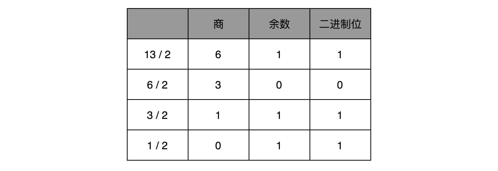

**原码表示法**有一个很直观的缺点就是，0 可以用两个不同的编码来表示，1000 代表 0， 0000 也代表 0。习惯万事一一对应的程序员看到这种情况，必然会被“逼死”。

于是就有了另一种表示方法，==补码==：仍然通过最左侧第一位的 0 和 1，来判断这个数的正负。但是，不再把这一位当成单独的符号位，在剩下几位计算出的十进制前加上正负号，而是在计算整个二进制值的时候，在左侧最高位前面加个负号。

比如，一个 4 位的二进制补码数值 1011，转换成十进制，就是 $−1×2^3+0×2^2+1×2^1+1×2^0 = -5$。

如果最高位是 1，这个数必然是负数；最高位是 0，必然是正数。并且，只有 0000 表示 0，1000 在这样的情况下表示 -8。一个 4 位的二进制数，可以表示从 -8 到 7 这 16 个整数，不会白白浪费一位。

当然更重要的一点是，用补码来表示负数，使得整数相加变得很容易，**不需要做任何特殊处理，只是把它当成普通的二进制相加，就能得到正确的结果**。

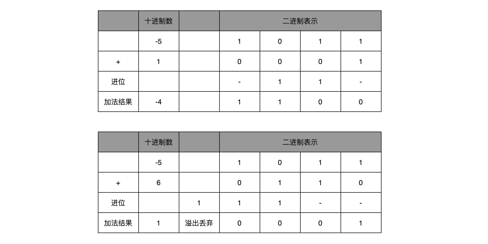

### 字符串的表示，从编码到数字

字符串（Character String）

ASCII 码（American Standard Code for Information Interchange，美国信息交换标准代码）

ASCII 码就好比一个字典，用 8 位二进制中的 128 个不同的数，映射到 128 个不同的字符里。

在 ASCII 码里面，数字 9 不再像整数表示法里一样，用 0000 1001 来表示，而是用 0011 1001 来表示。字符串 15 也不是用 0000 1111 这 8 位来表示，而是变成两个字符 1 和 5 连续放在一起，也就是 0011 0001 和 0011 0101，需要用两个 8 位来表示。

最大的 32 位整数，就是 2147483647。如果用整数表示法，只需要 32 位就能表示了。但是如果用字符串来表示，一共有 10 个字符，每个字符用 8 位的话，需要整整 80 位。比起整数表示法，要多占很多空间。

这也是为什么，很多时候我们在存储数据的时候，要采用==二进制序列化==这样的方式，而不是简单地把数据通过 CSV 或者 JSON，这样的文本格式存储来进行序列化。**不管是整数也好，浮点数也好，采用二进制序列化会比存储文本省下不少空间。**

英语使用ASCII是可以的，其他国家语言就需要创建对应的==字符集（Charset）==和==字符编码（Character Encoding）==。

字符集，表示的是字符的一个集合。比如日常说的 Unicode，其实就是一个字符集，包含了 150 种语言的 14 万个不同的字符。

而字符编码则是对于字符集里的这些字符，怎么一一用二进制表示出来的一个字典。比如Unicode，就可以用 UTF-8、UTF-16，乃至 UTF-32 来进行编码，存储成二进制。


同样的文本，采用不同的编码存储下来。如果另外一个程序，用一种不同的编码方式来进行解码和展示，就会出现==乱码==。


> “锟斤拷”和“烫烫烫”


### 思考题

> 如果二进制的加法中，有数是负数的时候该怎么处理呢？我们今天讲了补码的表示形式，如果这个负数是原码表示的，又应该如何处理？如果是补码表示的呢？请你用二进制加法试着算一算，-5+4=-1，通过原码和补码是如何进行的？

[-5+4]补=[-5]补+[4]补=[1011+0100]补=[1111]补 原码1001 


## 12 理解电路：从电报机到门电路，我们如何做到“千里传信”？

### 从信使到电报，我们怎么做到“千里传书”？

从信息编码的角度来说，金、鼓、灯塔、烽火台类似电报的二进制编码。电报传输的信号有两种，一种是短促的**点信号**（dot 信号），一种是长一点的**划信号**（dash 信号）。我们把“点”当成“1”，把“划”当成“0”。这样一来，我们的电报信号就是另一种特殊的二进制编码了。电影里最常见的电报信号是“SOS”，这个信号表示出来就是 “点点点划划划点点点”。

比起灯塔和烽火台这样的设备，==电报信号==有两个明显的优势。

- 第一，信号的传输距离迅速增加。因为电报本质上是通过电信号来进行传播的，所以从输入信号到输出信号基本上没有延时。
- 第二，输入信号的速度加快了很多。

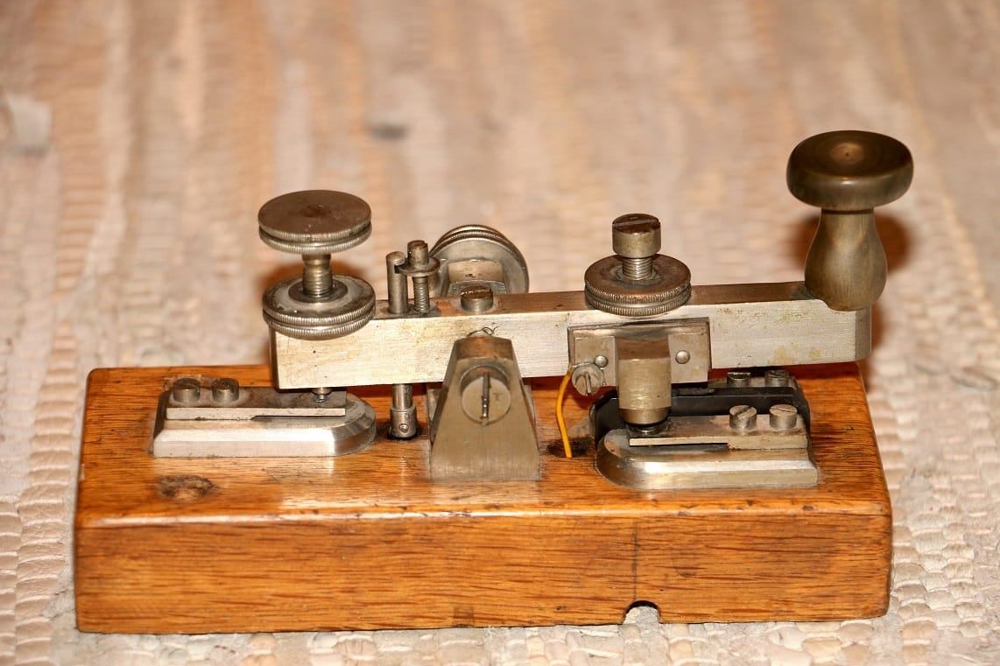

而且，制造一台==电报机==也非常容易。电报机本质上就是一个“==蜂鸣器 + 长长的电线 + 按钮开关==”。蜂鸣器装在接收方手里，开关留在发送方手里。双方用长长的电线连在一起。当按钮开关按下的时候，电线的电路接通了，蜂鸣器就会响。短促地按下，就是一个短促的点信号；按的时间稍微长一些，就是一个稍长的划信号。


### 理解继电器，给跑不动的信号续一秒

有了电报机，只要铺设好电报线路，就可以传输我们需要的讯息了。但是这里面又出现了一个新的挑战，就是随着电线的线路越长，电线的电阻就越大。当电阻很大，而电压不够的时候，即使你按下开关，蜂鸣器也不会响。

对于电报来说，电线太长了，使得线路接通也没有办法让蜂鸣器响起来。那么，我们就不要一次铺太长的线路，而把一小段距离当成一个线路。我们也可以跟驿站建立一个小电报站，在小电报站里面安排一个电报员。他听到上一个小电报站发来的信息，然后原样输入，发到下一个电报站去。这样，我们的信号就可以一段段传输下去，而不会因为距离太长，导致电阻太大，没有办法成功传输信号。为了能够实现这样**接力传输信号**，在电路里面，工程师们造了一个叫**==作继电器（Relay）==**的设备。


原样传输信号


当我们把输出端的“螺旋线圈 + 磁性开关”的组合，从默认关掉，只有通电有了磁场之后打开，换成默认是打开通电的，只有通电之后才关闭，我们就得到了一个计算机中的“非”操作。输出端开和关正好和输入端相反。这个在数字电路中，也叫作==反向器（Inverter）==。

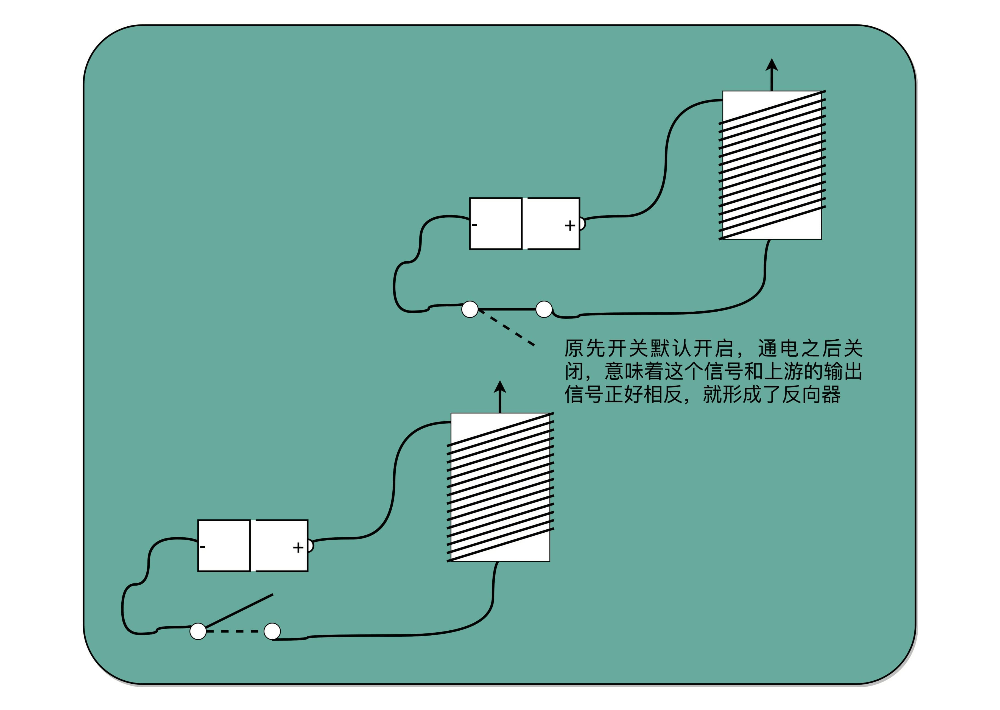

与、或、非的电路都非常简单，要想做稍微复杂一点的工作，我们需要很多电路的组合。不过，这也彰显了现代计算机体系中一个重要的思想，就是**通过==分层和组合==，逐步搭建起更加强大的功能**。

回到我们前面看的电报机原型，虽然一个按钮开关的电报机很“容易”操作，但是却不“方便”操作。因为电报员要熟记每一个字母对应的摩尔斯电码，并且需要快速按键来进行输入，一旦输错很难纠正。但是，因为电路之间可以通过与、或、非组合完成更复杂的功能，我们完全可以设计一个和打字机一样的电报机，每按下一个字母按钮，就会接通一部分电路，然后把这个字母的摩尔斯电码输出出去。

虽然在电报机时代，我们没有这么做，但是在计算机时代，我们其实就是这样做的。我们不再是给计算机“0”和“1”，而是通过千万个晶体管组合在一起，最终使得我们可以用“**高级语言**”，指挥计算机去干什么。

### 总结延伸

电报是现代计算机的一个最简单的原型。它和我们现在使用的现代计算机有很多相似之处。我们通过电路的“开”和“关”，来表示“1”和“0”。就像晶体管在不同的情况下，表现为导电的“1”和绝缘的“0”的状态。

我们通过电报机这个设备，看到了如何通过“螺旋线圈 + 开关”，来构造基本的逻辑电路，我们也叫==门电路==。一方面，我们可以通过==继电器或者中继==，进行长距离的信号传输。另一方面，我们也可以通过设置**不同的线路和开关状态**，实现更多**不同的信号表示和处理方式**，这些线路的连接方式其实就是我们在数字电路中所说的门电路。而这些门电路，也是我们创建 CPU 和内存的基本逻辑单元。我们的各种对于计算机二进制的“0”和“1”的操作，其实就是来自于门电路，叫作**组合逻辑电路**。

### 思考

> 除了与、或、非之外，还有很多基础的门电路，比如“异或（XOR）门”。你可以想一想，试着搜索一些资料，设计一个异或门的电路。


## 13 加法器：如何像搭乐高一样搭电路（上）？🔖


这些基本的门电路，是我们计算机硬件端的最基本的“积木”，就好像乐高积木里面最简单的小方块。看似不起眼，但是把它们组合起来，最终可以搭出一个星球大战里面千年隼这样的大玩意儿。我们今天包含十亿级别晶体管的现代 CPU，都是由这样一个一个的门电路组合而成的。

### 异或门和半加器


通过一个异或门计算出个位，通过一个与门计算出是否进位，我们就通过电路算出了一个一位数的加法。于是，我们把两个门电路打包，给它取一个名字，就叫作==半加器（Half Adder）==。

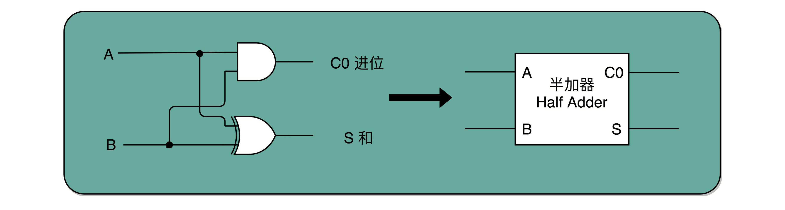

### 全加器

半加器可以解决个位的加法问题，但是如果放到二位上来说，就不够用了。我们这里的竖式是个二进制的加法，所以如果从右往左数，第二列不是十位，我称之为“二位”。对应的再往左，就应该分别是四位、八位。


### 总结延伸


> 出于性能考虑，实际 CPU 里面使用的加法器，比起我们今天讲解的电路还有些差别，会更复杂一些。真实的加法器，使用的是一种叫作==超前进位加法器==的东西。你可以找到北京大学在 Coursera 上开设的《计算机组成》课程中的 Video-306 “加法器优化”一节，了解一下超前进位加法器的实现原理，以及我们为什么要使用它。


### 思考题

> 如果是使用补码表示的有符号数，这个加法器是否可以实现正数加负数这样的运算呢？如果不行，我们应该怎么搭建对应的电路呢？

负数用补码表示的话加法就和正数的加法没什么区别了，只是结果如果是负数的话，也是补码。发生溢出会有问题，最高位符号有可能会变，需要额外的标记位。


## 14 乘法器：如何像搭乐高一样搭电路（下）？

十进制中的 13 乘以 9，转换成二进制：


### 顺序乘法的实现过程


### 并行加速方法


### 电路并行

门延迟（Gate Delay）


### 总结延伸

通过之前两讲的 ALU 和门电路，搭建出来了乘法器。如果愿意的话，我们可以把很多在生活中不得不顺序执行的事情，通过简单地连结一下线路，就变成并行执行了。这是因为，硬件电路有一个很大的特点，那就是**信号都是实时传输的**。

我们也看到了，通过精巧地设计电路，用较少的门电路和寄存器，就能够计算完成乘法这样相对复杂的运算。是用更少更简单的电路，但是需要更长的门延迟和时钟周期；还是用更复杂的电路，但是更短的==门延迟==和==时钟周期==来计算一个复杂的指令，**这之间的权衡，其实就是计算机体系结构中 RISC 和 CISC 的经典历史路线之争。**


### 思考题

> 如果我们想要用电路实现一个除法器，应该怎么做呢？需要注意一下，除法器除了要计算除法的商之外，还要计算出对应的余数。


## 15 浮点数和定点数（上）：怎么用有限的Bit表示尽可能多的信息？

### 浮点数的不精确性

40亿（2 的 32 次方）个数看似已经很多了，但是比起无限多的实数集合却只是沧海一粟。所以，这个时候，计算机的设计者们，就要面临一个问题了：我到底应该让这 40 亿个数映射到实数集合上的哪些数，在实际应用中才能最划得来呢？


### 定点数的表示

有一个很直观的想法，就是我们用 4 个比特来表示 0～9 的整数，那么 32 个比特就可以表示 8 个这样的整数。然后我们把最右边的 2 个 0～9 的整数，当成小数部分；把左边 6 个 0～9 的整数，当成整数部分。这样，我们就可以用 32 个比特，来表示从 0 到 999999.99 这样 1 亿个实数了。

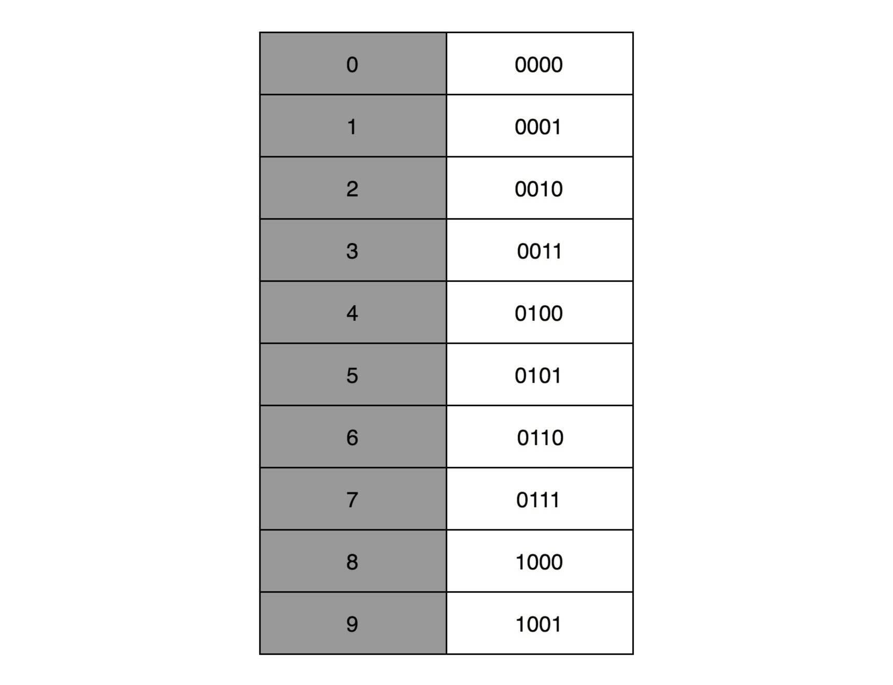

这种用二进制来表示十进制的编码方式，叫作==BCD编码==（Binary-Coded Decimal）。其实它的运用非常广泛，最常用的是在超市、银行这样需要用小数记录金额的情况里。在超市里面，我们的小数最多也就到分。这样的表示方式，比较直观清楚，也满足了小数部分的计算。

这样的表示方式的缺点：

- 第一，这样的表示方式有点“浪费”。本来 32 个比特我们可以表示 40 亿个不同的数，但是在 BCD 编码下，只能表示 1 亿个数，如果我们要精确到分的话，那么能够表示的最大金额也就是到 100 万。如果我们的货币单位是人民币或者美元还好，如果我们的货币单位变成了津巴布韦币，这个数量就不太够用了。
- 第二，这样的表示方式**没办法同时表示很大的数字和很小的数字**。我们在写程序的时候，实数的用途可能是多种多样的。有时候我们想要表示商品的金额，关心的是 9.99 这样小的数字；有时候，我们又要进行物理学的运算，需要表示光速，也就是 3×108 这样很大的数字。


### 浮点数的表示

> 有没有一个办法，既能够表示很小的数，又能表示很大的数呢？

就是==浮点数（Floating Point）==，也就是 float 类型。


用科学计数法来表示这个数字。宇宙内的原子的数量，大概在 10 的 82 次方左右，我们就用 1.0×1082 这样的形式来表示这个数值，不需要写下 82 个 0。

在计算机里，我们也可以用一样的办法，用科学计数法来表示实数。浮点数的科学计数法的表示，有一个 IEEE 的标准，它定义了两个基本的格式。一个是用 32 比特表示单精度的浮点数（float 或者 float32 类型）。另外一个是用 64 比特表示双精度的浮点数（double 或者 float64 类型）。

双精度类型和单精度类型差不多，这里以单精度类型例。


单精度的 32 个比特可以分成三部分：

- 符号位（s）。在浮点数里，我们不像正数分符号数还是无符号数，所有的浮点数都是有符号的。
- 指数位（e）。8 个比特能够表示的整数空间，就是 0～255。我们在这里用 1～254 映射到 -126～127 这 254 个有正有负的数上。因为我们的浮点数，不仅仅想要表示很大的数，还希望能够表示很小的数，所以指数位也会有负数。【这里的 0（也就是 8 个比特全部为 0） 和 255 （也就是 8 个比特全部为 1）另有它用】
- 有效数位（f）。

$$(-1)^s * 1.f * 2^e$$

里的浮点数，没有办法表示 0。的确，要表示 0 和一些特殊的数，我们就要用上在 e 里面留下的 0 和 255 这两个表示，这两个表示其实是两个标记位。在 e 为 0 且 f 为 0 的时候，我们就把这个浮点数认为是 0。至于其它的 e 是 0 或者 255 的特殊情况，你可以看下面这个表格，分别可以表示出无穷大、无穷小、NAN 以及一个特殊的不规范数。


以 0.5 为例子。0.5 的符号为 s 应该是 0，f 应该是 0，而 e 应该是 -1，也就是$0.5=(−1)^0×1.0×2^{−1} = 0.5$，对应的浮点数表示，就是 32 个比特。

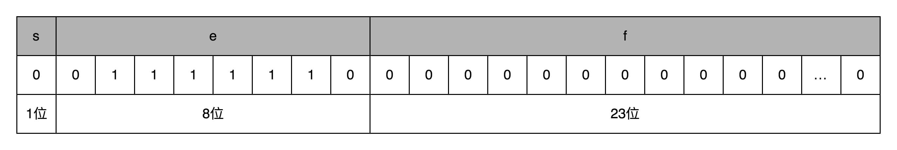

s=0，$e=2^{−1}$，需要注意，e 表示从 -126 到 127 个，-1 是其中的第 126 个数，这里的 e 如果用整数表示，就是 

26+25+24+23+22+21=126，1.f=1.0。

在这样的浮点数表示下，不考虑符号的话，浮点数能够表示的最小的数和最大的数，差不多是 $1.17×10^{−38}$ 和 $3.40×10^{38}$。比前面的 BCD 编码能够表示的范围大多了。


### 思考题

> 对于 BCD 编码的定点数，如果我们用 7 个比特来表示连续两位十进制数，也就是 00～99，是不是可以让 32 比特表示更大一点的数据范围？如果我们还需要表示负数，那么一个 32 比特的 BCD 编码，可以表示的数据范围是多大？


## 16 浮点数和定点数（下）：深入理解浮点数到底有什么用？

浮点数可以大到$3.40×10^{38}$，也可以小到$1.17×10^{−38}$。平时写的 0.1、0.2 并不是精确的数值，只是一个近似值。只有 0.5 这样，可以表示成 $2^{−1}$ 这种形式的，才是一个精确的浮点数。

### 浮点数的二进制转化🔖


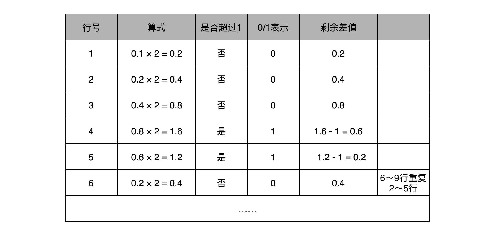

十进制浮点数 9.1，用二进制表示就是：

上一讲讲过，浮点数其实是用二进制的科学计数法来表示的，所以我们可以把小数点左移三位，这个数就变成了：

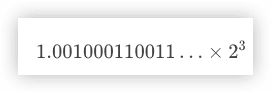


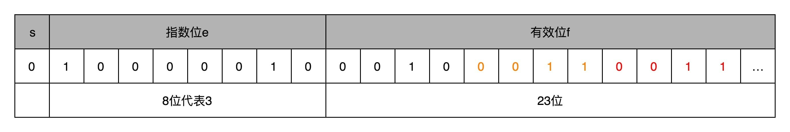


### 浮点数的加法和精度损失


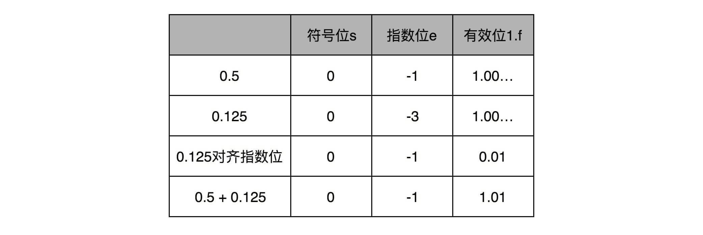

浮点数的加法过程，其中指数位较小的数，需要在有效位进行右移，在右移的过程中，最右侧的有效位就被丢弃掉了。这会导致对应的指数位较小的数，在加法发生之前，就==丢失精度==。两个相加数的指数位差的越大，位移的位数越大，可能丢失的精度也就越大。当然，也有可能你的运气非常好，右移丢失的有效位都是 0。这种情况下，对应的加法虽然丢失了需要加的数字的精度，但是因为对应的值都是 0，实际的加法的数值结果不会有精度损失。

### Kahan Summation 算法


### 总结延伸

一般情况下，在实践应用中，对于需要精确数值的，比如银行存款、电商交易，我们都会使用定点数或者整数类型。

比方说，你一定在 MySQL 里用过 decimal(12,2)，来表示订单金额。如果我们的银行存款用 32 位浮点数表示，就会出现，马云的账户里有 2 千万，我的账户里只剩 1 块钱。结果银行一汇总总金额，那 1 块钱在账上就“不翼而飞”了。

而浮点数呢，则更适合我们不需要有一个非常精确的计算结果的情况。因为在真实的物理世界里，很多数值本来就不是精确的，我们只需要有限范围内的精度就好了。比如，从我家到办公室的距离，就不存在一个 100% 精确的值。我们可以精确到公里、米，甚至厘米，但是既没有必要、也没有可能去精确到微米乃至纳米。

对于浮点数加法中可能存在的精度损失，特别是大量加法运算中累积产生的巨大精度损失，我们可以用 Kahan Summation 这样的软件层面的算法来解决。


### 思考题

> 这两节我讲的都是 32 位浮点数，那么对于 64 位浮点数的加法，两个数相差多少的情况后，较小的哪个数在加法过程中会完全丢失呢？


# 原理篇：处理器


## 17 建立数据通路（上）：指令+运算=CPU

### 指令周期（Instruction Cycle）

计算机每执行一条指令的过程，可以分解成这样几个步骤：

1. ==Fetch（取得指令）==，也就是从 PC 寄存器里找到对应的指令地址，根据指令地址从内存里把具体的指令，加载到指令寄存器中，然后把 PC 寄存器自增，好在未来执行下一条指令。
2. ==Decode（指令译码）==，也就是根据指令寄存器里面的指令，解析成要进行什么样的操作，是 R、I、J 中的哪一种指令，具体要操作哪些寄存器、数据或者内存地址。
3. ==Execute（执行指令）==，也就是实际运行对应的 R、I、J 这些特定的指令，进行算术逻辑操作、数据传输或者直接的地址跳转。
4. 重复进行 1～3 的步骤。

上面的步骤就是一个永不停歇的“**Fetch - Decode - Execute**”的循环，我们把这个循环称之为**==指令周期（Instruction Cycle）==**。


在取指令的阶段，我们的指令是放在**存储器**里的，实际上，通过 PC 寄存器和指令寄存器取出指令的过程，是由**控制器**（Control Unit）操作的。指令的解码过程，也是由控制器进行的。一旦到了执行指令阶段，无论是进行算术操作、逻辑操作的 R 型指令，还是进行数据传输、条件分支的 I 型指令，都是由**算术逻辑单元**（ALU）操作的，也就是由**运算器**处理的。不过，如果是一个简单的无条件地址跳转，那么我们可以直接在控制器里面完成，不需要用到运算器。


CPU另外两个常见的 Cycle：

- **Machine Cycle，机器周期或者CPU周期**。从内存里面读取一条指令的最短时间。
- Clock Cycle，也就是**时钟周期**以及机器的主频。

一个 CPU 周期，通常会由几个时钟周期累积起来。

对于一个指令周期来说，我们取出一条指令，然后执行它，至少需要两个 CPU 周期。取出指令至少需要一个 CPU 周期，执行至少也需要一个 CPU 周期，复杂的指令则需要更多的 CPU 周期。

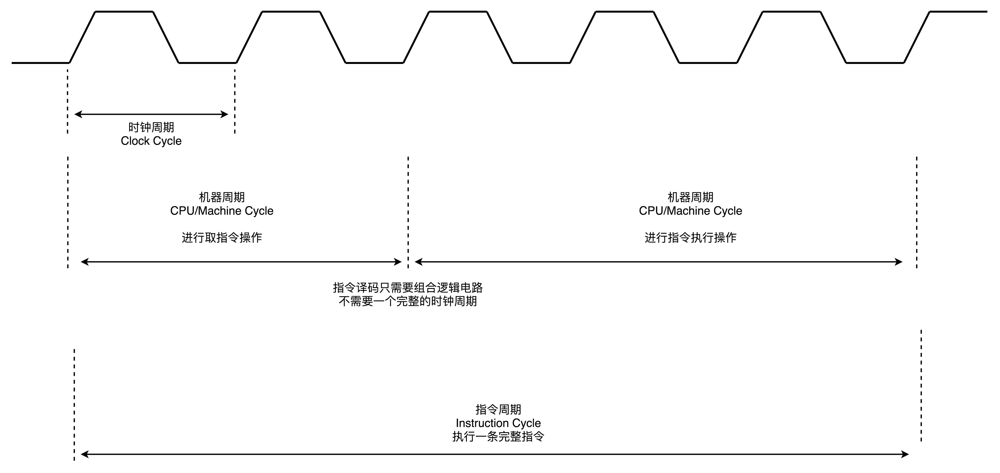


### 建立数据通路


数据通路就是我们的处理器单元。它通常由两类原件组成：

- 第一类叫==操作元件==，也叫组合逻辑元件（Combinational Element）
- 第二类叫==存储元件==，也有叫状态元件（State Element）。比如我们在计算过程中需要用到的寄存器，无论是通用寄存器还是状态寄存器，其实都是存储元件。

通过数据总线的方式，把它们连接起来，就可以完成数据的存储、处理和传输了，这就是所谓的==建立数据通路==了。


==控制器==的逻辑就没那么复杂，可以把它看成只是机械地重复“Fetch - Decode - Execute“循环中的前两个步骤，然后把最后一个步骤，通过控制器产生的控制信号，交给 ALU 去处理。

控制器的电路特别复杂：

一方面，所有 CPU 支持的指令，都会在控制器里面，被解析成不同的输出信号。我们之前说过，现在的 Intel CPU 支持 2000 个以上的指令。这意味着，控制器输出的控制信号，至少有 2000 种不同的组合。

运算器里的 ALU 和各种组合逻辑电路，可以认为是一个固定功能的电路。控制器“翻译”出来的，就是不同的控制信号。这些控制信号，告诉 ALU 去做不同的计算。可以说正是控制器的存在，让我们可以“编程”来实现功能，能让我们的“存储程序型计算机”名副其实。


### CPU 所需要的硬件电路

要想搭建出来整个 CPU，需要在数字电路层面，实现这样一些功能。


### 总结延伸

CPU运转需要的数据通路和控制器，完成这些功能需要4种基本电路：**==ALU这样的组合逻辑电路、用来存储数据的锁存器和 D 触发器电路、用来实现 PC 寄存器的计数器电路，以及用来解码和寻址的译码器电路==**。

虽然 CPU 已经是由几十亿个晶体管组成的及其复杂的电路，但是它仍然是由这样一个个基本功能的电路组成的。只要搞清楚这些电路的运作原理，你自然也就弄明白了 CPU 的工作原理。

### 思考题

> CPU 好像一个永不停歇的机器，一直在不停地读取下一条指令去运行。那为什么 CPU 还会有满载运行和 Idle 闲置的状态呢？请你自己搜索研究一下这是为什么?


## 18 建立数据通路（中）：指令+运算=CPU

组合逻辑电路（Combinational Logic Circuit），只需要给定输入，就能得到固定的输出。

时序逻辑电路（Sequential Logic Circuit）解决的问题：

- 自动运行的问题
- 存储的问题
- 解决了各个功能按照**时序协调**的问题


### 时钟信号的硬件实现


### 通过 D 触发器实现存储功能


### 总结延伸

通过引入了==时序电路==，我们终于可以把数据“存储”下来了。我们通过==反馈电路==，创建了==时钟信号==，然后再利用这个时钟信号和==门电路==组合，实现了“==状态记忆==”的功能。

电路的输出信号不单单取决于当前的输入信号，还要取决于输出信号之前的状态。最常见的这个电路就是我们的 D 触发器，它也是我们实际在 CPU 内实现存储功能的寄存器的实现方式。

这也是现代计算机体系结构中的“冯·诺伊曼”机的一个关键，就是程序需要可以“存储”，而不是靠固定的线路连接或者手工拨动开关，来实现计算机的**可存储和可编程**的功能。

有了时钟信号和触发器之后，我们还差一个“自动”需求没有实现。我们的计算机还不能做到自动地不停地从内存里面读取指令去执行。【下一节，怎么让程序自动运转起来】


### 思考题

> 现在我们的 CPU 主频非常高了，通常在几 GHz 了，但是实际上我们的晶振并不能提供这么高的频率，而是通过“外频 + 倍频“的方式来实现高频率的时钟信号。请你研究一下，倍频和分频的信号是通过什么样的电路实现的？


## 19 建立数据通路（下）：指令+运算=CPU


### PC 寄存器所需要的计数器


单指令周期处理器（Single Cycle Processor）


### 读写数据所需要的译码器


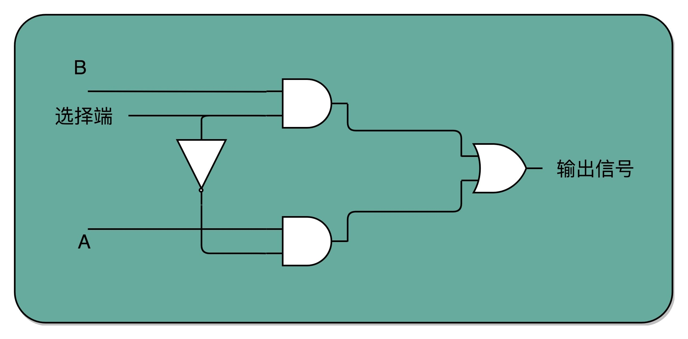


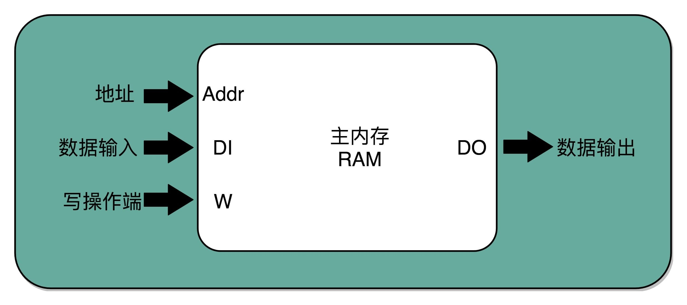


### 建立数据通路，构造一个最简单的 CPU


### 总结延伸

怎么通过连接不同功能的电路，实现出一个完整的 CPU。

可以通过自动计数器的电路，来实现一个 PC 寄存器，不断生成下一条要执行的计算机指令的内存地址。然后通过译码器，从内存里面读出对应的指令，写入到 D 触发器实现的指令寄存器中。再通过另外一个译码器，把它解析成我们需要执行的指令和操作数的地址。这些电路，组成了我们计算机五大组成部分里面的控制器。

把 opcode 和对应的操作数，发送给 ALU 进行计算，得到计算结果，再写回到寄存器以及内存里面来，这个就是我们计算机五大组成部分里面的运算器。

时钟信号，则提供了协调这样一条条指令的执行时间和先后顺序的机制。同样的，这也带来了一个挑战，那就是单指令周期处理器去执行一条指令的时间太长了。【这个挑战，也是接下来的几讲里要解答的问题】

### 思考题

> CPU 在执行无条件跳转的时候，不需要通过运算器以及 ALU，可以直接在控制器里面完成，你能说说这是为什么吗？


## 20 面向流水线的指令设计（上）：一心多用的现代CPU


### 单指令周期处理器


快速执行完成的指令，需要等待满一个时钟周期，才能执行下一条指令


### 现代处理器的流水线设计


### 超长流水线的性能瓶颈


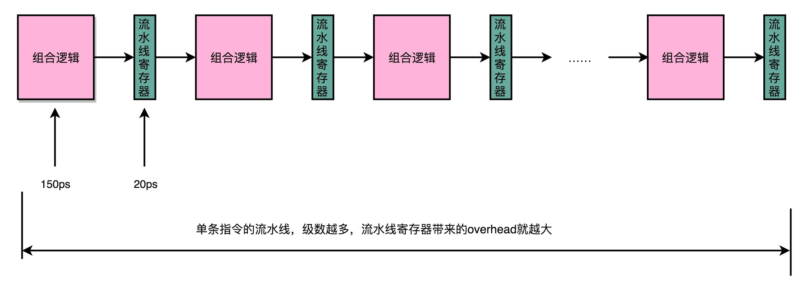

### 总结延伸

为了能够不浪费 CPU 的性能，通过把指令的执行过程，切分成一个一个流水线级，来提升 CPU 的吞吐率。而本身的 CPU 的设计，又是由一个个独立的组合逻辑电路串接起来形成的，天然能够适合这样采用流水线“专业分工”的工作方式。

因为每一级的 overhead，一味地增加流水线深度，并不能无限地提高性能。同样地，因为指令的执行不再是顺序地一条条执行，而是在上一条执行到一半的时候，下一条就已经启动了，所以也给我们的程序带来了很多挑战。【后面几节】

### 思考题

> 一个 CPU 的时钟周期，可以认为是完成一条简单指令的时间。在这一讲之后，你觉得这句话正确吗？为什么？在了解了 CPU 的流水线设计之后，你是怎么理解这句话的呢？


## 21 面向流水线的指令设计（下）：奔腾4是怎么失败的？


### “主频战争”带来的超长流水线


### 新的挑战：冒险和分支预测


## 22 冒险和预测（一）：hazard是“危”也是“机”

CPU的流水线需要解决的三大冒险：结构冒险（Structural Hazard）、数据冒险（Data Hazard）以及控制冒险（Control Hazard）。

### 结构冒险：为什么工程师都喜欢用机械键盘？


现代 CPU 架构，借鉴了哈佛架构，在高速缓存层面拆分成指令缓存和数据缓存


### 数据冒险：三种不同的依赖关系


#### 先写后读（Read After Write，RAW）


#### 先读后写（Write After Read，WAR）


#### 写后再写（Write After Write，WAW）


### 再等等：通过流水线停顿解决数据冒险

流水线停顿（Pipeline Stall），或者叫流水线冒泡（Pipeline Bubbling）


## 23 冒险和预测（二）：流水线里的接力赛

### NOP 操作和指令对齐


### 流水线里的接力赛：操作数前推


## 24 冒险和预测（三）：CPU里的“线程池”

### 填上空闲的 NOP：上菜的顺序不必是点菜的顺序


### CPU 里的“线程池”：理解乱序执行


## 25 冒险和预测（四）：今天下雨了，明天还会下雨么？

### 分支预测：今天下雨了，明天还会继续下雨么？


### 为什么循环嵌套的改变会影响性能？


## 26 Superscalar和VLIW：如何让CPU的吞吐率超过1？

### 多发射与超标量：同一时间执行的两条指令


### Intel 的失败之作：安腾的超长指令字设计


## 27 SIMD：如何加速矩阵乘法？

单指令多数据流（SIMD）技术

### 超线程：Intel 多卖给你的那一倍 CPU


### SIMD：如何加速矩阵乘法？


## 28 异常和中断：程序出错了怎么办？

### 异常：硬件、系统和应用的组合拳


### 异常的分类：中断、陷阱、故障和中止


### 异常的处理：上下文切换


## 29 CISC和RISC：为什么手机芯片都是ARM？

复杂指令集（Complex Instruction Set Computing，简称 CISC）

精简指令集（Reduced Instruction Set Computing，简称 RISC）


### Intel 的进化：微指令架构的出现


### ARM 和 RISC-V：CPU 的现在与未来


## 30 GPU（上）：为什么玩游戏需要使用GPU？

### GPU 的历史进程


### 图形渲染的流程


对于图像进行实时渲染的过程，可以被分解成下面这样 5 个步骤：

#### 1 顶点处理（Vertex Processing）


#### 2 图元处理（Primitive Processing）


#### 3 栅格化（Rasterization）


#### 4 片段处理（Fragment Processing）


#### 5 像素操作（Pixel Operations）


### 解放图形渲染的 GPU


## 31 GPU（下）：为什么深度学习需要使用GPU？


### Shader 的诞生和可编程图形处理器


### 现代 GPU 的三个核心创意


#### 芯片瘦身


#### 多核并行和 SIMT


#### GPU 里的“超线程”


### GPU 在深度学习上的性能差异


## 32 FPGA和ASIC：计算机体系结构的黄金时代

### FPGA

FPGA，也就是现场可编程门阵列（Field-Programmable Gate Array）


### ASIC

ASIC（Application-Specific Integrated Circuit），也就是专用集成电路


## 33 解读TPU：设计和拆解一块ASIC芯片

### TPU V1 想要解决什么问题？


### 深入理解 TPU V1

#### 快速上线和向前兼容，一个 FPU 的设计


#### 专用电路和大量缓存，适应推断的工作流程

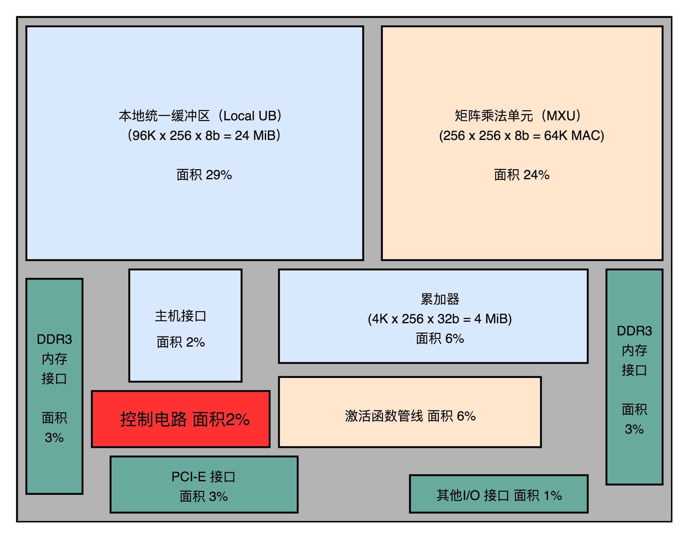

#### 细节优化，使用 8 Bits 数据


### 用数字说话，TPU 的应用效果


## 34 理解虚拟机：你在云上拿到的计算机是什么样的？

### 缘起分时系统


### 从“黑色星期五”到公有云


### 虚拟机的技术变迁


# 原理篇：存储和I/O系统

## 35 存储器层次结构全景：数据存储的大金字塔长什么样？

### 理解存储器的层次结构


SRAM

DRAM

存储器的层级结构

使用存储器的时候，该如何权衡价格和性能？


## 36 局部性原理：数据库性能跟不上，加个缓存就好了？

### 理解局部性原理


### 如何花最少的钱，装下亚马逊的所有商品？


## 37 高速缓存（上）：“4毫秒”究竟值多少钱？


## 38 高速缓存（下）：你确定你的数据更新了么？

### “隐身”的变量


### CPU 高速缓存的写入

写直达（Write-Through）


写回（Write-Back）


## 39 MESI协议：如何让多核CPU的高速缓存保持一致？

### 缓存一致性问题


### 总线嗅探机制和 MESI 协议


## 40 理解内存（上）：虚拟内存和内存保护是什么？

### 简单页表


### 多级页表


## 41 理解内存（下）：解析TLB和内存保护

### 加速地址转换：TLB


### 安全性与内存保护

#### 可执行空间保护


#### 地址空间布局随机化


## 42 总线：计算机内部的高速公路

### 降低复杂性：总线的设计思路来源


### 理解总线：三种线路和多总线架构


## 43 输入输出设备：我们并不是只能用灯泡显示“0”和“1”

### 接口和设备：经典的适配器模式


### CPU 是如何控制 I/O 设备的？


### 信号和地址：发挥总线的价值


## 44 理解IO_WAIT：I/O性能到底是怎么回事儿？

### IO 性能、顺序访问和随机访问


如何定位 IO_WAIT？


## 45 机械硬盘：Google早期用过的“黑科技”

### 拆解机械硬盘


### Partial Stroking：根据场景提升性能


## 46 SSD硬盘（上）：如何完成性能优化的KPI？

### SSD 的读写原理


### SLC、MLC、TLC 和 QLC


### P/E 擦写问题


### SSD 读写的生命周期


## 47 SSD硬盘（下）：如何完成性能优化的KPI？

磨损均衡、TRIM 和写入放大效应


FTL 和磨损均衡


TRIM 指令的支持


写入放大


AeroSpike：如何最大化 SSD 的使用效率？


## 48 DMA：为什么Kafka这么快？

直接内存访问（Direct Memory Access）技术


### Kafka 的实现原理


## 49 数据完整性（上）：硬件坏了怎么办？


### 单比特翻转：软件解决不了的硬件错误


### 奇偶校验和校验位：捕捉错误的好办法


## 50 数据完整性（下）：如何还原犯罪现场？

### 海明码：我们需要多少信息冗余？


### 海明码的纠错原理


### 海明距离：形象理解海明码的作用


## 51 分布式计算：如果所有人的大脑都联网会怎样？

### 从硬件升级到水平扩展


### 理解高可用性和单点故障


# 应用篇

理解了计算机各个组件的运作之后，最后一个模块将手把手带你实操。利用存储器层次结构设计大型 DMP 系统，并通过 Disruptor，跟你一起感受 CPU 的风驰电掣，让你真正学有所用。

## 52 设计大型DMP系统（上）：MongoDB并不是什么灵丹妙药


DMP：数据管理平台


## 53 设计大型DMP系统（下）：SSD拯救了所有的DBA

### 关系型数据库：不得不做的随机读写


### Cassandra：顺序写和随机读

Cassandra 的数据模型


Cassandra 的读操作


### SSD：DBA 们的大救星


## 54 理解Disruptor（上）：带你体会CPU高速缓存的风驰电掣

### Padding Cache Line，体验高速缓存的威力


### 使用 RingBuffer，利用缓存和分支预测


## 55 理解Disruptor（下）：不需要换挡和踩刹车的CPU，有多快？

### 缓慢的锁


### 无锁的 RingBuffer


