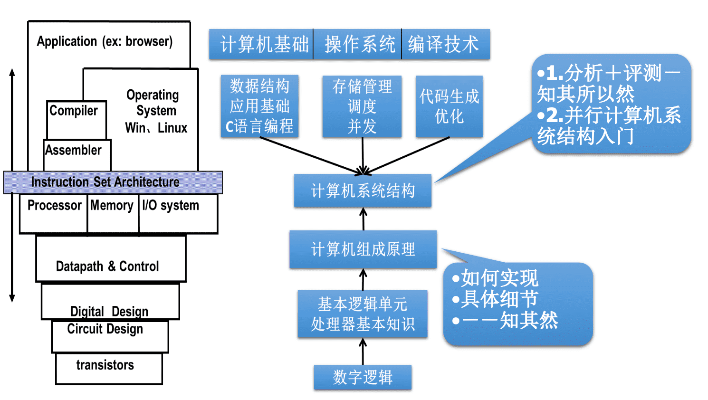

《计算机组成原理(哈工大)》视频课程学习笔记

-------

刘宏伟

[计算机组成原理（上）](http://www.icourse163.org/course/HIT-309001?tid=1002253005)

[计算机组成原理(哈工大)](https://www.bilibili.com/video/BV1ix41137Eu)

### 课程简介

计算机体系中，唯一一门讲述硬件逻辑的课程。

关键字：计算机、组成、原理

#### 讲授内容：

基本部件的结构和组织方式

基本运算的操作原理

基本部件和单元的设计思想

#### 特色：

计算机组成的一般原理，不以具体机型为依托

采用自顶向下的方式、层层细化

#### 教材：

唐朔飞  《计算机组成原理（第2版）》高等教育出版社  2008年1月

习题指导教材：

唐朔飞  《计算机组成原理--学习指导与习题解答（第2版）》高等教育出版社  2012年7月

参考教材：

1. David A.Patterson. John L.Hennessy. Computer Organization & Design: A Hardware/Software Interface （《计算机组成与设计：硬件软件接口》 ）

   RISC

2. David Harris, Sarah Harris. Digital Design and Computer Architecture. Morgan Kaufmann, 2007（《数字设计和计算机体系结构》）

#### 本课程在课程体系中的地位

#### 本书结构

#### 课程的分割

##### 计算机组成原理之机器：（一、二、三、四、五）

1. 基本概念
2. 总线
3. 存储器
4. 输入输出系统

##### 计算机组成原理之数字：（六）

1. 计算机中数的表示
2. 计算机的运算方法和运算器

##### 计算机组成原理之CPU：（七、八、九、十）

1. 指令系统
2. CPU的结构和功能
3. 控制单元
4. 控制单元的结构

## 一、计算机系统概论

### 1.1 计算机系统简介

现代计算机的多态性

把**感应器**嵌入和装备到**电网、铁 路、桥梁、隧道、 公路、建筑、供水系统、大坝、油气管道等**各种物体中，并且被普遍连接，形成所谓“**物联网**”， 然后将“物联网” 与现有的互联网整合起来，实现人类社会与物理系统的整合，形 成智慧地球。

#### 1.1.1 计算机的软硬件概念

##### 计算机系统

硬件： 计算机的实体， 如主机、外设等

软件： 由具有各类特殊功能 的信息(程序)组成

##### 软件的两大类：

###### 系统软件：用来管理整个计算机系统

- 语言处理程序 

- 操作系统 

- 服务性程序   （数学库等）

- 数据库管理系统 

- 网络软件

###### 应用软件：按任务需要编制成的各种程序

#### 1.1.2 计算机系统的层次结构

##### 系统复杂性管理的方法

抽象-隐藏系统中不重要的细节。----- David Harris

计算机组成原理主要研究 **Logic**和**Mirco-architecture**层。

从程序员角度抽象

汇编语言与机器语言一般是一一对应的

<u>计算机组成与计算机系统结构从研究内容上来说有什么区别呢?</u>

答：计算机系统结构定义计算机系统软硬件的交界面，定义了那些功能由软件来实现，那些功能由硬件来实现，提供了上层软件编写时与硬件交互的接口。

#### 1.1.3 计算机体系结构和计算机组成

**计算机体系结构**，程序员所见到的计算机系统的属性概念性的结构与功能特性，包括指令系统、数据类型、寻址技术、I/O机理等。（**有无乘法指令**）

**计算机组成**，实现计算机体系结构所体现的属性。（**如何实现乘法指令**）

## 二、计算机的发展及应用

## 三、系统总线

## 四、存储器

## 五、输入输出系统

## 六、计算机的运算方法

## 七、指令系统

7.1  机器指令

7.2  操作数类型和操作类型

7.3 寻址方式

7.4 指令格式举例

7.5 RISC技术

## 八、CPU的结构和功能

8.1 CPU的结构

8.2 指令周期

8.3 指令流水

8.4 中断系统

## 九、控制单元的功能

9.1 操作命令的分析

9.2 控制单元的功能

## 十、控制单元的设计

10.1 组合逻辑设计

10.2 微程序设计

