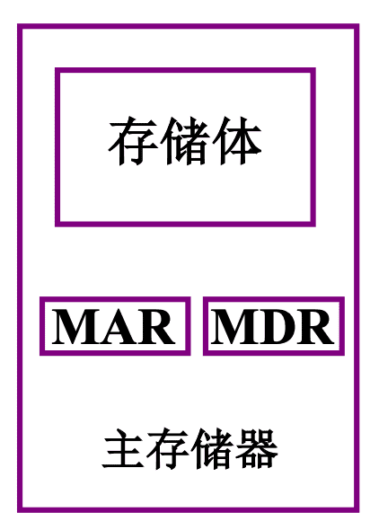

《计算机组成原理(哈工大)》视频课程学习笔记

-------

刘宏伟

[计算机组成原理（上）](http://www.icourse163.org/course/HIT-309001?tid=1002253005)

[计算机组成原理(哈工大)](https://www.bilibili.com/video/BV1ix41137Eu)


### 课程简介

计算机体系中，唯一一门讲述硬件逻辑的课程。

关键字：计算机、组成、原理

#### 讲授内容：

基本部件的结构和组织方式

基本运算的操作原理

基本部件和单元的设计思想


#### 特色：

计算机组成的一般原理，不以具体机型为依托

采用自顶向下的方式、层层细化


#### 教材：

唐朔飞  《计算机组成原理（第2版）》高等教育出版社  2008年1月

习题指导教材：

唐朔飞  《计算机组成原理--学习指导与习题解答（第2版）》高等教育出版社  2012年7月


参考教材：

1. David A.Patterson. John L.Hennessy. Computer Organization & Design: A Hardware/Software Interface （《计算机组成与设计：硬件软件接口》 ）

   RISC

2. David Harris, Sarah Harris. Digital Design and Computer Architecture. Morgan Kaufmann, 2007（《数字设计和计算机体系结构》）


#### 本课程在课程体系中的地位


#### 本书结构


#### 课程的分割

##### 计算机组成原理之机器：（一、二、三、四、五）

1. 基本概念
2. 总线
3. 存储器
4. 输入输出系统

##### 计算机组成原理之数字：（六）

1. 计算机中数的表示
2. 计算机的运算方法和运算器

##### 计算机组成原理之CPU：（七、八、九、十）

1. 指令系统
2. CPU的结构和功能
3. 控制单元
4. 控制单元的结构


## 一、计算机系统概论


### 1.1 计算机系统简介

现代计算机的多态性


把**感应器**嵌入和装备到**电网、铁 路、桥梁、隧道、 公路、建筑、供水系统、大坝、油气管道等**各种物体中，并且被普遍连接，形成所谓“**物联网**”， 然后将“物联网” 与现有的互联网整合起来，实现人类社会与物理系统的整合，形 成智慧地球。


#### 1.1.1 计算机的软硬件概念

##### 计算机系统

硬件： 计算机的实体， 如主机、外设等

软件： 由具有各类特殊功能 的信息(程序)组成


##### 软件的两大类：

###### 系统软件：用来管理整个计算机系统

- 语言处理程序 

- 操作系统 

- 服务性程序   （数学库等）

- 数据库管理系统 

- 网络软件

###### 应用软件：按任务需要编制成的各种程序


#### 1.1.2 计算机系统的层次结构

##### 系统复杂性管理的方法-1  抽象

抽象-隐藏系统中不重要的细节。----- David Harris


计算机组成原理主要研究 **Logic**和**Mirco-architecture**层。


从程序员角度抽象

汇编语言与机器语言一般是一一对应的


<u>计算机组成与计算机系统结构从研究内容上来说有什么区别呢?</u>

答：计算机系统结构定义计算机系统软硬件的交界面，定义了那些功能由软件来实现，那些功能由硬件来实现，提供了上层软件编写时与硬件交互的接口。


#### 1.1.3 计算机体系结构和计算机组成

**计算机体系结构**，程序员所见到的计算机系统的属性概念性的结构与功能特性，包括指令系统、数据类型、寻址技术、I/O机理等。（**有无乘法指令**）

**计算机组成**，实现计算机体系结构所体现的属性。（**如何实现乘法指令**）


### 1.2 计算机的基本组成


#### 1.2.1 冯·诺依曼计算机的特点

1. 计算机由五大部件组成：运算器、存储器、控制器、输入设备、输出设备

2. 指令和数据以同等地位存于存储器，可按地址寻访

3. 指令和数据用二进制表示

4. 指令由操作码和地址码组成

5. **存储程序**

6. 以运算器为中心


冯·诺依曼计算机硬件框图：


这个结构的缺陷：

以运算器为中心，使运算器成为瓶颈；

看上去比较乱，不具有层次化的特征

#### 1.2.2 计算机

##### 1.以存储器为中心的计算机硬件框图


##### 2.现代计算机硬件框图


###### 系统复杂性管理的方法-2 (3’Y)

- 层次化(Hierachy):将被设计的系统 划分为多个模块或子模块。

- 模块化(Modularity):有明确定义 (well-defined)的功能和接口。（才能让子模块很好的组装在一起）

- 规则性(regularity):模块更容易被重用。（让子模块在不同系统和机器上都能使用）


问题:一个现实中的问题，如何用计算机来解决？

问题:是不是所有的问题都可以用计算的方法来解决？

**可计算理论**

假设我们面对的是一个可以有计算机解决的问题， 如何用计算机来解决这个问题呢？


#### 1.2.3 计算机的工作步骤

##### 1.上机前的准备 

- 建立数学模型

  

- 确定计算方法

  

- 编制解题程序
  程序 —— 运算的全部步骤

  指令——每一个步骤


编程举例

```
计算 ax2+bx+c  =  (ax+b)x+c

取x 至运算器中			取x 至运算器中 						
乘以x 在运算器中			乘以a 在运算器中
乘以a在运算器中			加b 在运算器中
存ax2 在存储器中		乘以x 在运算器中 
取b 至运算器中			加c 在运算器中
乘以x 在运算器中
加ax2 在运算器中
加c 在运算器中 
```


指令格式举例

> ACC（Accumulator）是累加器


计算ax2 +bx+c 程序清单


- 指令和数据都是保存在存储器中的

  

  存储器的结构?
  如何进行访问? 

  每次访问获得的数据的位数是多少呢?

##### 2.计算机的解题过程

###### （1）存储器的基本组成



```
存储体 – 存储单元  – 存储元件(0/1) 
大楼   – 房间     – 床位(无人/有人)
```

**存储单元** 存放一串二进制代码

**存储字** 	存储单元中二进制代码的组合

**存储字长** 存储单元中二进制代码的位数，每个存储单元赋予一个地址号

**按地址寻访**


**MAR** 	存储器地址寄存器，反映存储单元的个数

**MDR** 	存储器数据寄存器，反映存储字长


设MAR=4位， MDR=8位

存储单元个数 16

存储字长 8


• 已经知道了存储器的基本组成 

• 运算器的结构是什么?

• 运算器功能是什么?，如何工作的? 

– 加法?

– 乘法?


🔖https://www.bilibili.com/video/BV1ix41137Eu?p=8


## 二、计算机的发展及应用


## 三、系统总线


## 四、存储器


## 五、输入输出系统


## 六、计算机的运算方法


## 七、指令系统

7.1  机器指令

7.2  操作数类型和操作类型

7.3 寻址方式

7.4 指令格式举例

7.5 RISC技术


## 八、CPU的结构和功能

8.1 CPU的结构

8.2 指令周期

8.3 指令流水

8.4 中断系统


## 九、控制单元的功能

9.1 操作命令的分析

9.2 控制单元的功能


## 十、控制单元的设计

10.1 组合逻辑设计

10.2 微程序设计

